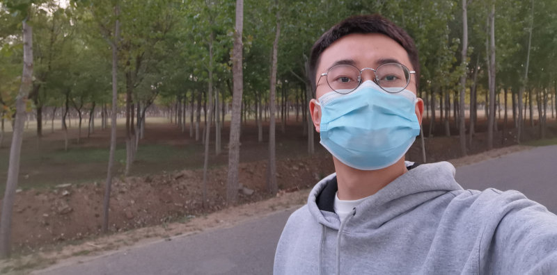

# About me
   
Hello, My name is Yannan Zhang. I'm from China. I become interested in Electronics when I was a small child. My grandfather was an electrician when I was young. He stored all his electronic components in a drawer. One day, I found all that shiny small things and smashed them using a hammer. Since then, my fate was destined. 

# Education
+ ***Beijing University of Posts and Telecommunications***   
Sept. 2017 - July 2020, **M.S. in Electronic Science and Technology**   
*First Class Scholarship, 2019*   
*First Class Scholarship, 2018*   
*First Class Scholarship, 2017*   

+ ***Beijing University of Posts and Telecommunications***  
Sept. 2013 - July 2017, **B.S. in Electronic Science and Technology**   
*Qualcomm Scholarship, 2016*   
*First Prize in Beijing Undergraduate Electronics Design Contest, 2016*   

# Academic Achievement & Publications
[1] [K. Han, **Y. Zhang** and Z. Deng, "A Simulation Study of Gate-All-Around Nanowire Transistor With a Core-Substrate," in IEEE Access, vol. 8, pp. 62181-62190, 2020, doi: 10.1109/ACCESS.2020.2983724.](https://ieeexplore.ieee.org/document/9049338)   
[2] [**Zhang, Y.**; Han, K.; Li, A.J. A Simulation Study of a Gate-All-Around Nanowire Transistor with a Core–Insulator. Micromachines 2020, 11, 223.](https://www.mdpi.com/2072-666X/11/2/223?type=check_update)   
*Note: Actually, I'm the first author of [1].*

# English Certificate

# Experience
+ **Beijing University of Posts and Telecommunications**     
December 2017 - May 2018, Beijing, China   
*A member of National 863 Program in “14 nm Technology Generation Silicon-Based Novel Devices and Key Crafts Research of China”*   

+ **Beijing University of Posts and Telecommunications**   
Teaching Assistant  
December 2016 - September 2017, Beijing, China   
*Training 45 undergraduate students to attend “National Undergraduate Electronics Design Contest”*   

+ **Intel Mobile Communications Technology (Beijing) Ltd.**   
Internship - Embeded System Testing  
October 2016 - December 2016, Beijing, China   
*Migrating former software framework into new system.*   
*Developing baseband modem (XMM7560) software.*   
*Debugging and Testing.*   

# Projects
### Circuit Design
+ [Bandgap Reference](pages/bandgap.md)
+ [Low Drop Voltage Regulator]()
+ [Fully Differential Amplifier]()
+ [50MSPS 8 bit Asynchronous SAR ADC]()
+ [500MHz Bandwidth 80dB Dynamic Rage AM Receiver]()

### PCB Layout
+ [LMH6554 2.8-GHz Ultra Linear Fully Differential Amplifier Demonstration Board]()
+ [Low Harmonic Distortion PCB for Operational Amplifier](pages/LowDistortionAmpPCB.md)

### CMOS Devices

### Embeded System Softeare

# My Video Tutorial
Once I was a high school student, I was attracted by the electronic world. I wanted to learn how to program microcontrollers and how to build my own audio amplifier. But without a tutor or someone to guide me, I felt so painful to learn those esoteric knowledge. I understand the pain that a starter feel, so I'm trying to share my limited knowledge to help those who want to enter the electronic world but don't know how to do.   
**Below are some video tutorials that I recorded. These videos explain knowledge in a more practical way, not a academic way, which can help starters to enter the world quickly.**

+ [An introduction to the basic concept and usage of Digital to Analog Converter.](https://www.youtube.com/playlist?list=PLGBDFkRTcisEuyedRHiHl547lP2yFqDW9)   
+ [An introduction to the basic concept and usage of Opeartional Amplifier.]()   
+ [Programming TI's MSP430G2553 launchpad using C language.]()   

# My Antique Electronic Collection
[See My Collections](pages/collections.md)

### Contact
E-mail: murmures@bupt.edu.cn

