# About this project   

This project was intended to **find out a better way to layout a high speed operational amplifier**, this is of paramount importance because high speed opamp can be used in many applications and they serve to build the signal chain. If the signal after being amplified by the opamp are distorted, then the whole system cannot have a good performance.    
A careless and perfunctory layout can lead to high distortion. I realized this problem when I was using a TI's high speed opamp **THS3201** to amplify a 20MHz small signal. The input signal was provided by a signal generator, the output signal after being amplified was being examined by a oscilloscope.   
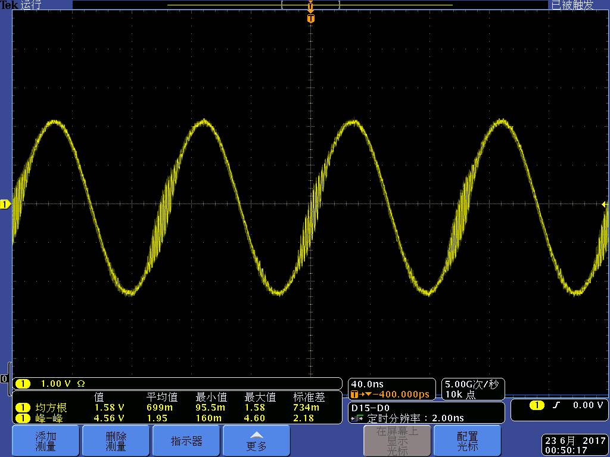   

The waveform was really ugly, it's noisy as well as having the tendency to oscillate when it is crossing the zero volt. so I decided to find out the reason and solution.   

# Possible reason   

At first, I have no idea about the cause of the problem, I asked many people, including some professors and experts but no one could give me an answer. So I had to think of it by myself.   

## Impedance matching problem?   
***No, I have conducted many experiments, but the results didn't get any better.***   

## Layout problem?   

The original layout was shown below. All the important signal paths are shown.   

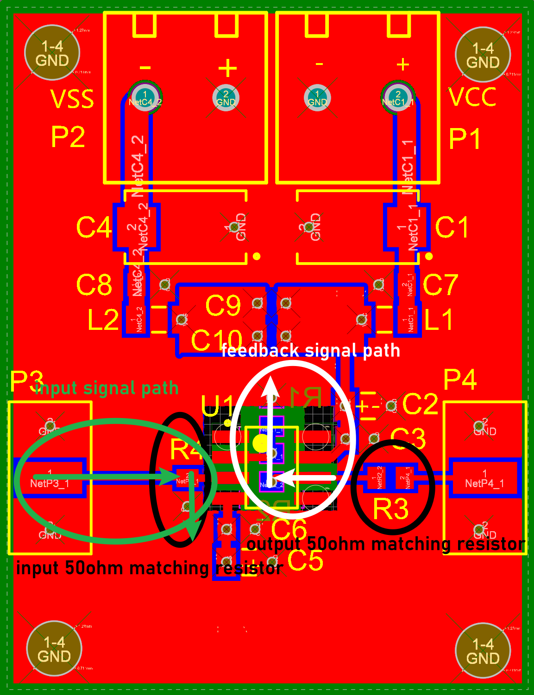   

In order to find out if the feedback signal path is the culprit, I arranged the feedback resistors in four different ways to form four different feedback paths.   

+ ***The first layout.***   

   The first layout is same as the original design, the feedback signal path is also the same.   

   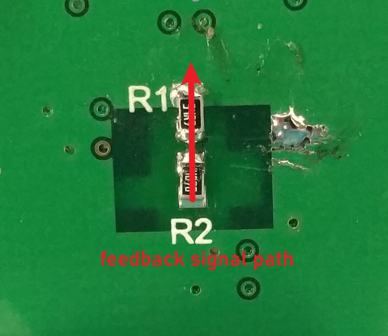   

+ ***The second layout.***   

   The second layout changed the direction of R1, as shown in figure.   

   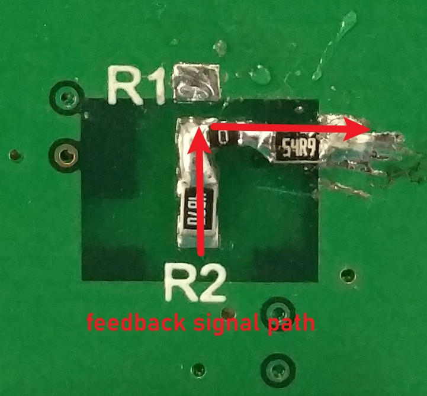   

+ ***The third layout.***   

   The third layout moved the R1 to the top layer. Actually, the third layout is same as the second layout, but its feedback signal path ends on the top layer of PCB.   

   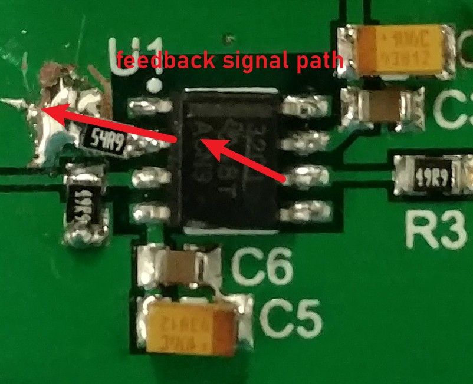   

+ ***The fourth layout.***   

   The fourth layout also moved the R1 to the top layer. Besides, the R1 was arranged in a way so that the feedback signal path and input signal path ends at the same point.   

   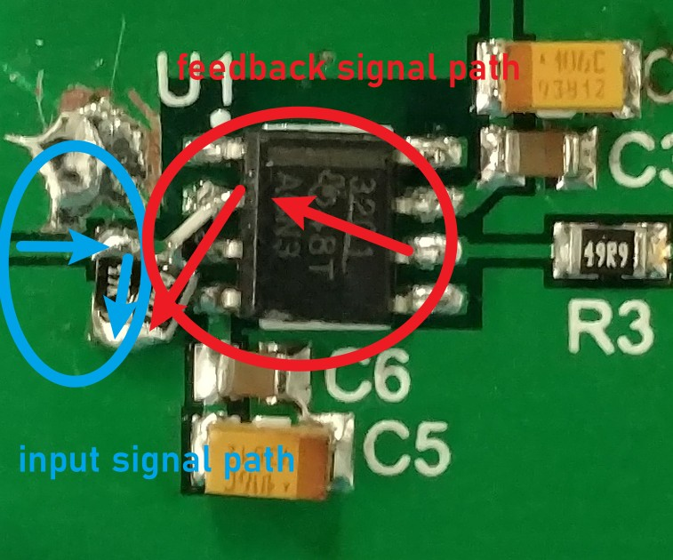   

# Measurement Results   

## Input frequency = 10M, input power = 3dBm   

+ ***Waveform***   
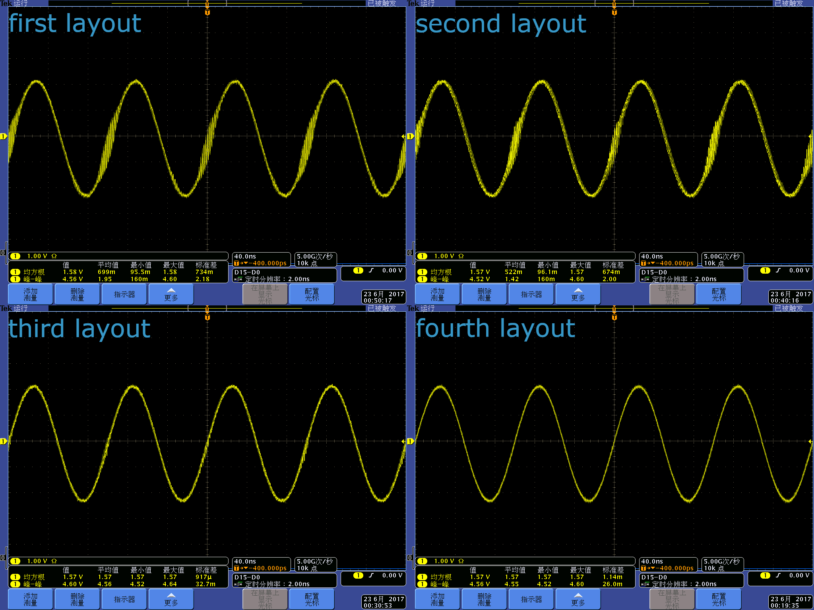   
+ ***Spectrum***   
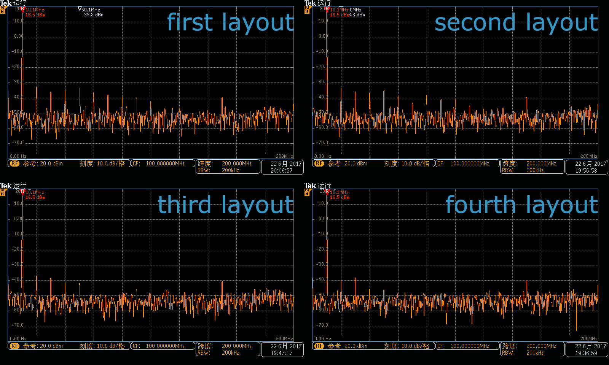   
+ ***Data***
*The Unit is dBm.*   
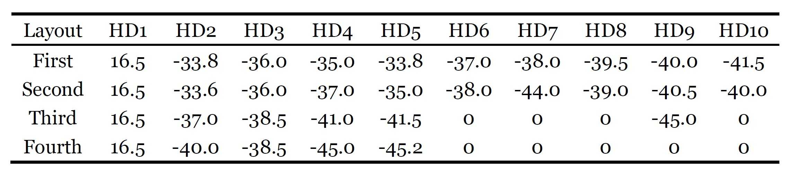   
 
## Input frequency = 50M, input power = 3dBm
+ ***Waveform***   
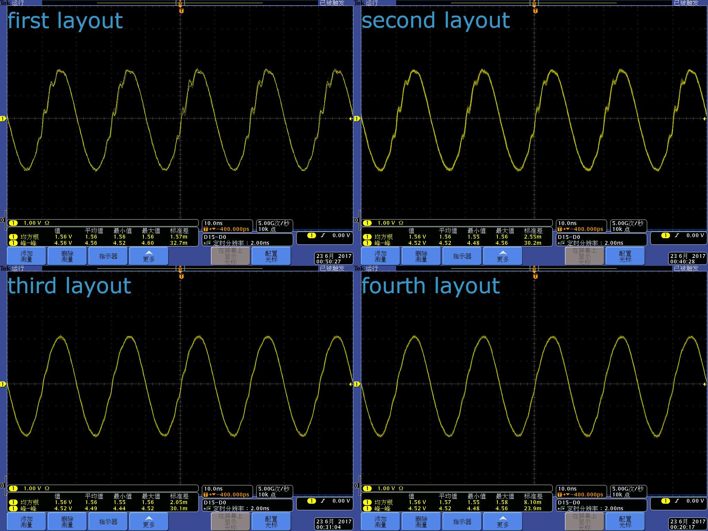   
+ ***Spectrum***   
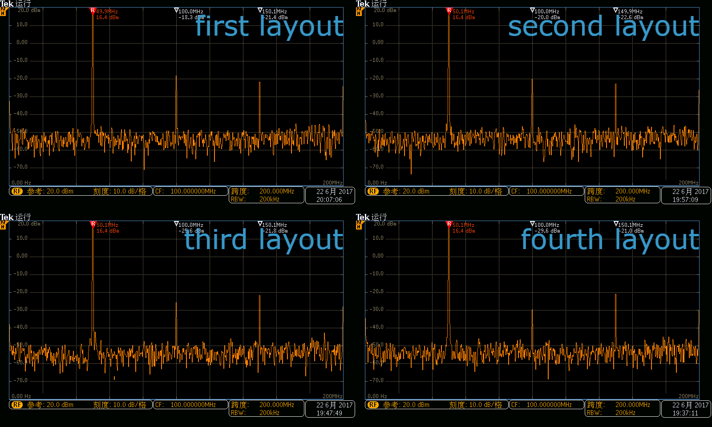  
+ ***Data***
*The Unit is dBm.*   
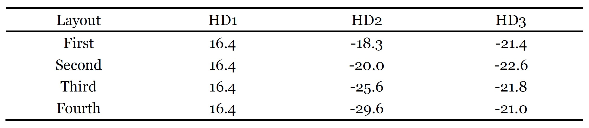   

## Comparision between testing results and datasheet   
By checking the datasheet, we are able to find out that the HD2 at 10MHz is about -58dBc, and the HD2 at 50MHz is about -46dBc.   
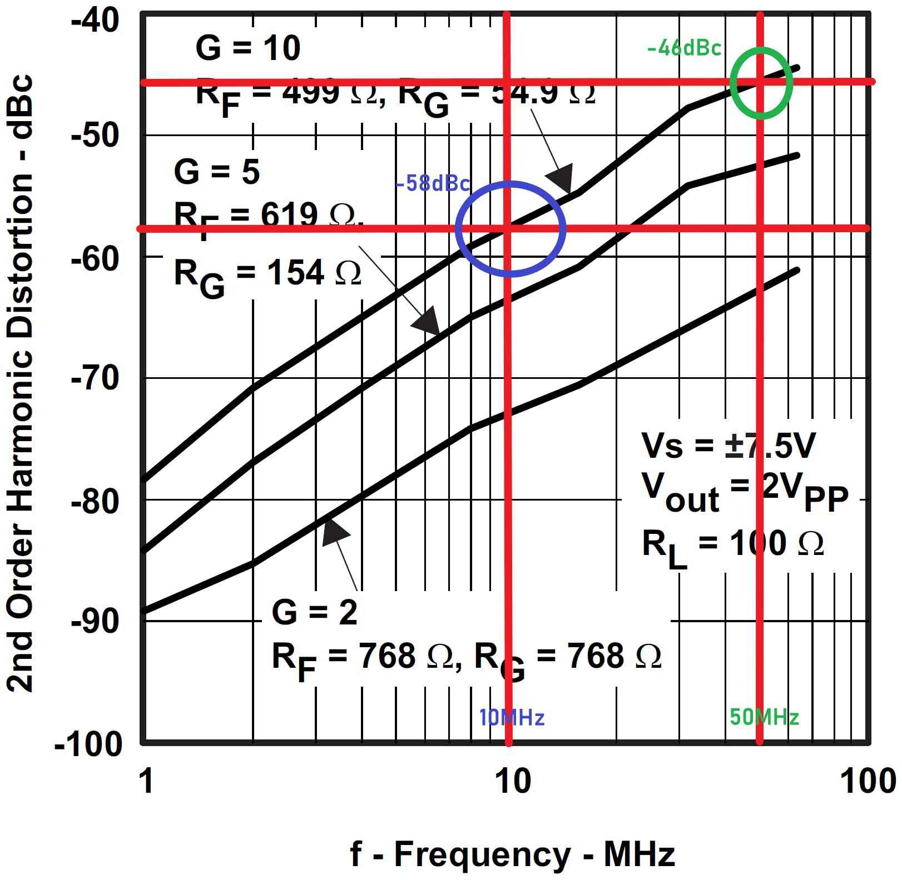   
While the real testing results in terms of different layouts are shown below:   
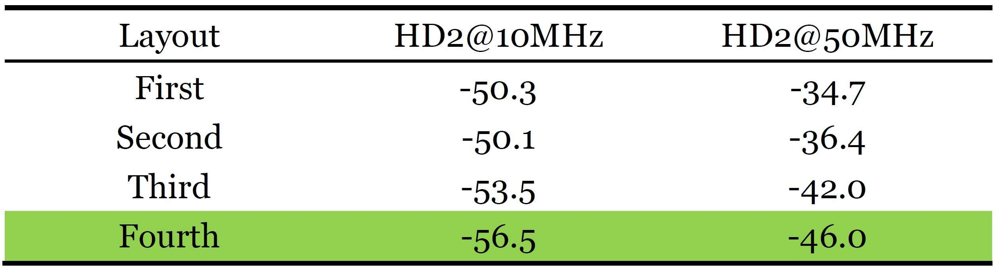   
**Since the fourth layout's testing results are almost the same as the official data. It's the best layout and can realize the full potential of a high speed opeartional amplifier.**  

## Comparision between my pcb and official demonstration pcb   
[TI's official demonstration pcb](https://www.ti.com.cn/tool/cn/DEM-OPA-SO-1B) helps designers evaluate the operation and performance of TI's single high speed, wideband operational amplifiers. Since the official pcb can realize the full potential of their product, it's reasonable to compare my pcb's performance with official one.  
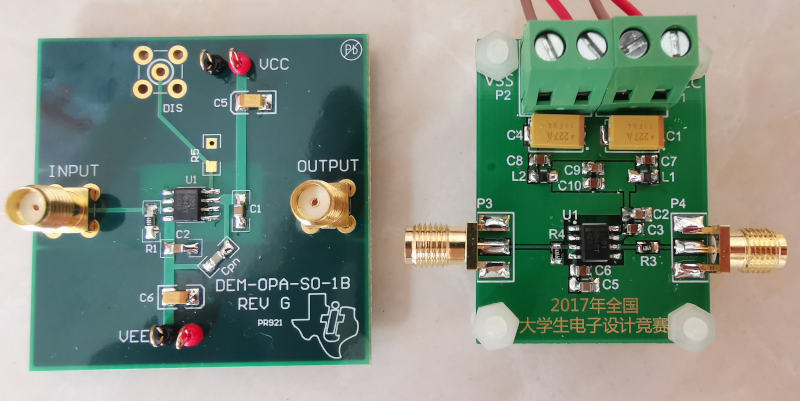
+ **The official demonstration pcb testing results:**   
**The input signal power is -10dBm, RF=487, RG=24.9, the unit of testing results are dBm**   
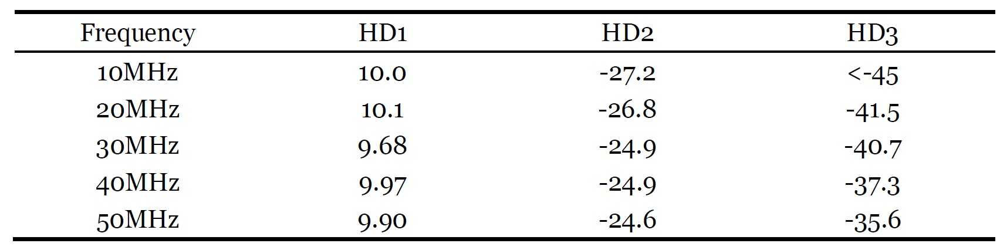   
+ **My pcb testing results:**   
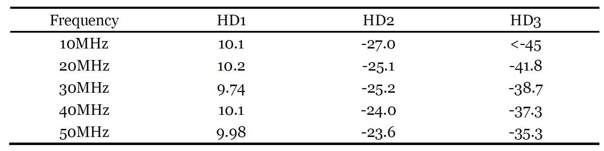   
***It can be found that at some particula frequency, the official pcb perform slightly better than my pcb, but my pcb has a smoother frequency response than that of official one.***

# Conclusion      

**The 4th layout is the best layout, that means, the feedback signal path and the input signal path should end at the same point. And, it can realize the full potential of a high speed opeartional amplifier.**    

# The final version of layout   

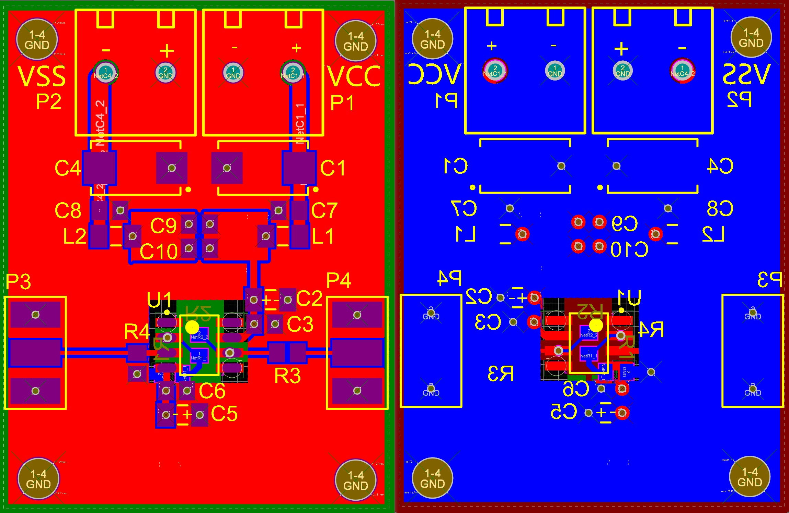   
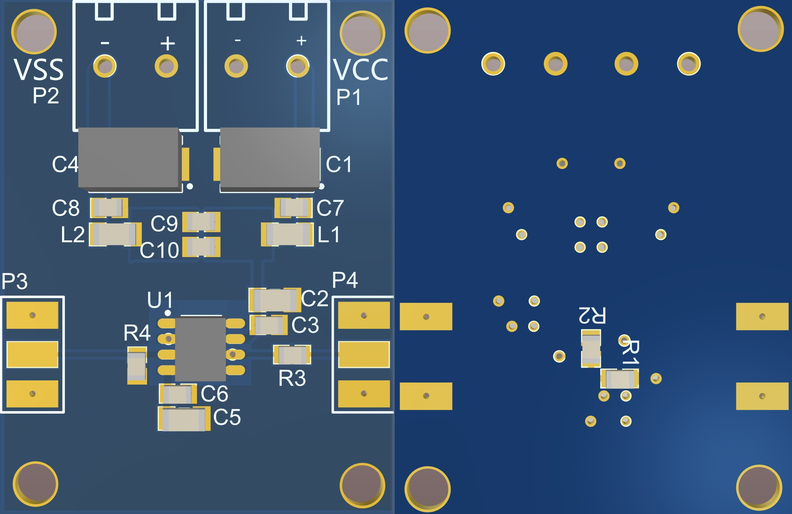  

# What I have learned from this project.
+ **Usually, the decoupling capacitor doesn't have that much of an impact on the circuit performance compared with layout as long as the decoupling capacitor is properly placed.**    
+ **The number of layer of a PCB doesn't have that much of an impact on the circuit performance than I have expected. If the circuit is not too complex and was properly routed, the two layers and four layers pcb almost make no difference.**   
+ **The feedback signal path and the input signal path should end at the same point in order to minimize the distortion.**   

# Unresolved problems   
+ ***Why the feedback signal path can badly affect the performance of the whole circuit? There must be some theoratical explanation.***   
+ ***Why the harmonic distortion of an amplifier can increase with the input signal frequency?***   

# Home Page
[Return to Home Page](https://yannanzhang512.github.io/YannanZhang/)
