# 关于此项目   
这个项目的目的在于**找到最大化发挥高速运算放大器的布局布线方法**, 由于运算放大器具有多种用途，在信号链中具有举足轻重的地位，如果放大器的失真过高，那么将导致波形畸变，还会产生不需要的频率成分。这个问题起源于我在使用德州仪器的高速运算放大器**THS3201**时遇到的问题，当时我想用THS3201放大20MHz小信号，但我发现放大后的信号具有较大的偶次谐波失真，而官方数据手册中给出的失真并没有我这么大，为了解决这个问题，就有了如下的研究。   
   
上图显示了输入频率为10MHz时的输出波形，波形噪声很大，在过零点处有震荡的趋势。      

# 可能的原因      
## 阻抗匹配问题?   
***我对PCB做了阻抗匹配，但是结果并没有改变，因此不是阻抗匹配的原因。***   

## 布局布线问题?   

最初的布局如下所示，图中标出重要的信号通路。   
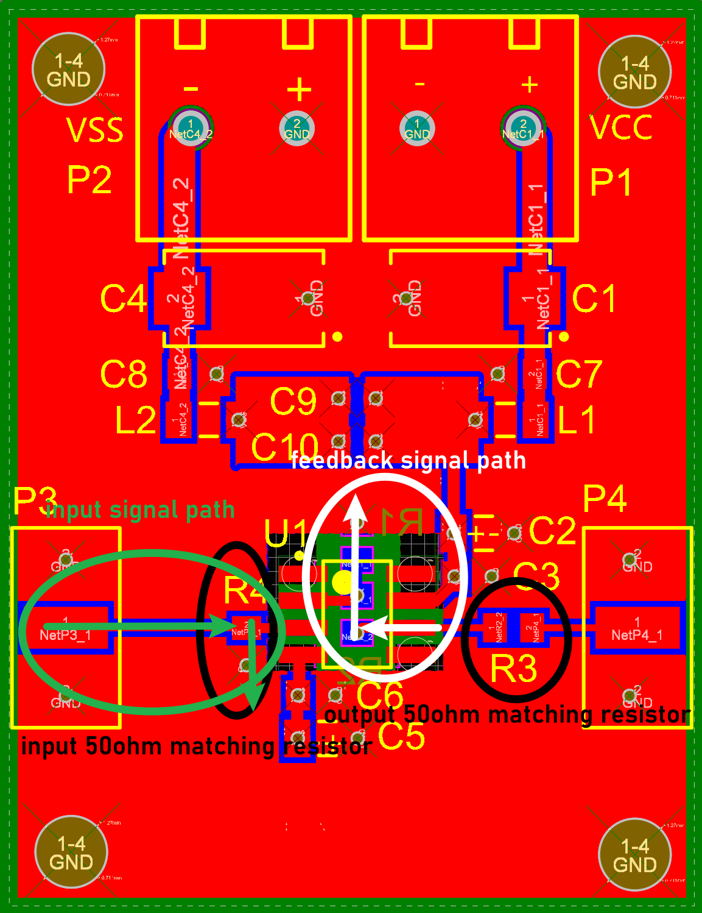   

为了确认是否是反馈信号通路布局方法的原因，我尝试了四种不同的反馈信号通路布局方法，并将每种方法进行测试。四种不同的布局布线方法如下所示：      

+ ***第一种布局***   

   第一种布局如下所示，同时也是我的最初布局。   

      

+ ***第二种布局***   

   第二种布局将R1的方向稍作改变, 如下图所示：      

   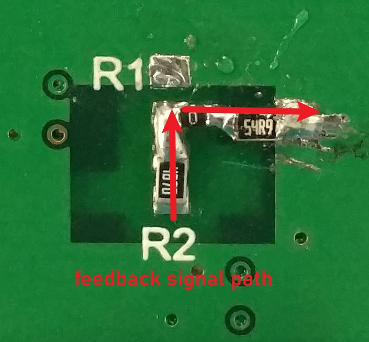   

+ ***第三种布局***   

   第三种布局将R1放到顶层。实际上，第三种布局与第二种布局很相似，但是第三种布局的反馈信号通路接地点在顶层。      

   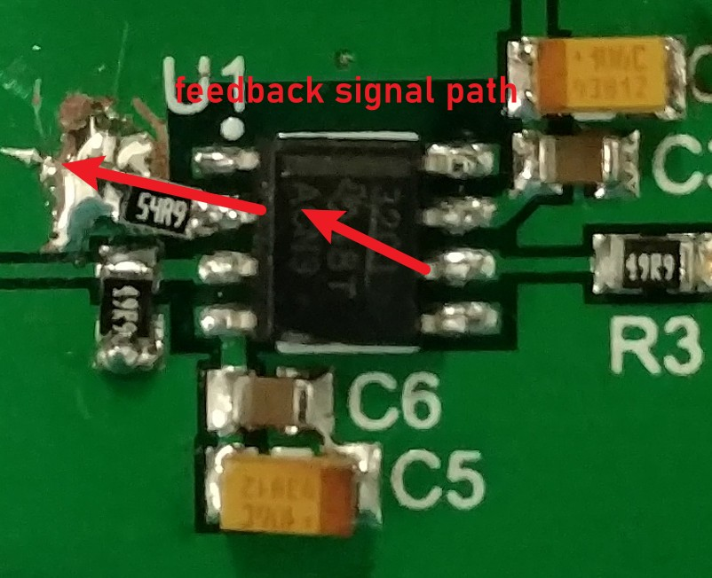   

+ ***第四种布局***   

   第四种布局同样将R1移动到顶层。除此之外，反馈信号通路的接地点与输入信号的接地点交于同一位置。   

   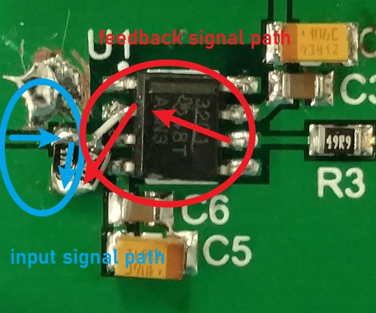   

# 测量结果   

## 输入信号频率 = 10M, 输入功率 = 3dBm   

+ ***测试波形***   
   
+ ***测试频谱***   
   
+ ***测试数据***
*单位为dBm.*   
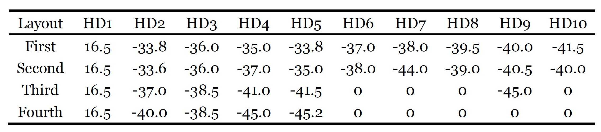   
 
## 输入信号频率 = 50M, 输入功率 = 3dBm
+ ***测试波形***   
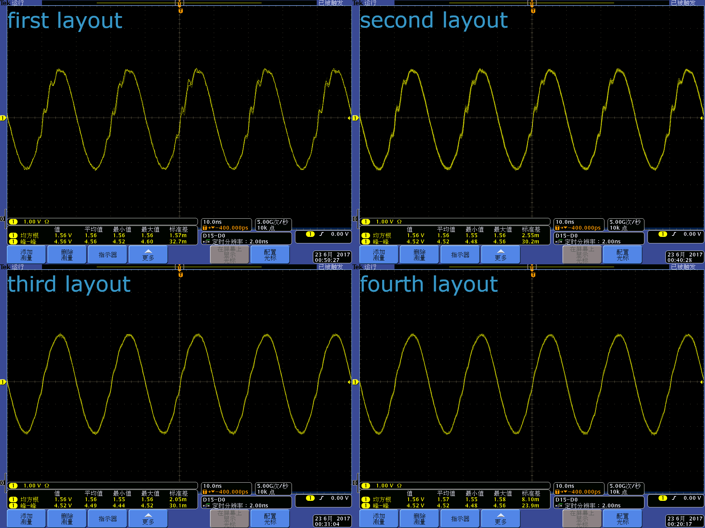   
+ ***测试频谱***   
  
+ ***测试数据***
*单位为dBm.*   
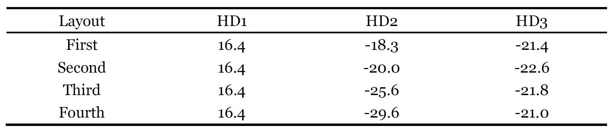   

## 测试数据与官方数据手册对比   
数据手册指出，10MHz时的二次谐波失真为-58dBc, 50MHz时的二次谐波失真为-46dBc.   
   
四种不同布局的实际测试结果如下所示:   
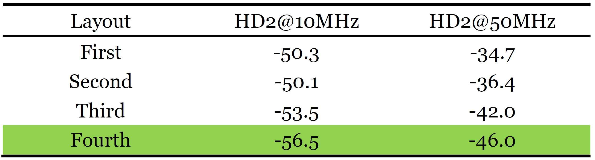   
**第四种布局的测试结果与数据手册上的官方测试值几乎一样，因此这种布局布线方法能够最大限度发挥高速运算放大器的性能。**  

## 第四种布局与官方评估板的测试对比   
[德州仪器为高速运算放大器设计的官方评估板](https://www.ti.com.cn/tool/cn/DEM-OPA-SO-1B) 能够帮助设计者评估运算放大器的性能并且进行原型验证。由于官方设计的评估板能发挥出他们产品的最大性能，因此是一个非常好的参考。  
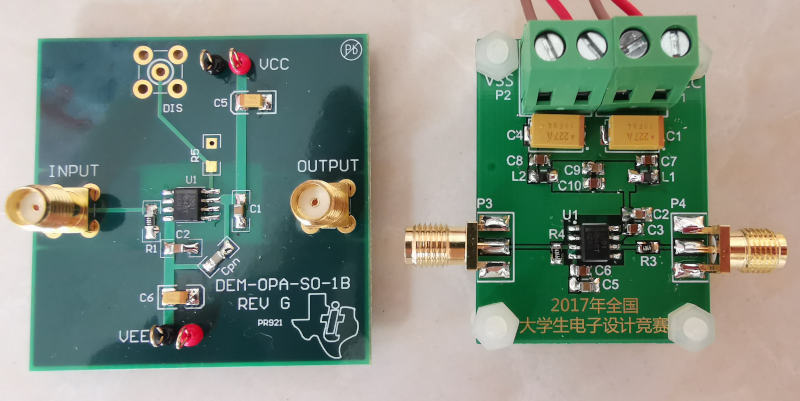
+ **官方评估板的测试数据:**   
**输入信号功率-10dBm, RF=487, RG=24.9, 测试结果的单位为dBm**   
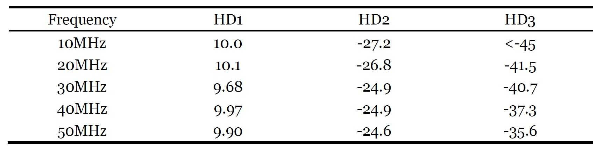   
+ **第四种布局布线的测试结果:**   
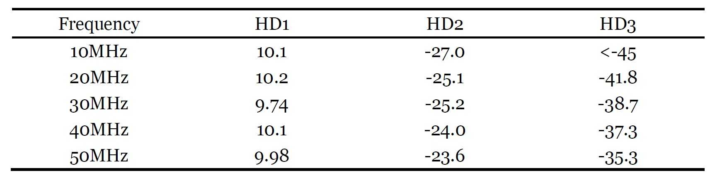   
***在某些频点，官方评估板的结果比我的布局布线测试结果稍好，我的布局布线具有更平坦的频率响应。***

# 结论     
**第四种布局是最佳布局，反馈信号通路的接地点要与输入信号接地点一致，这种布线具有最小谐波失真**    

# 最终版本的布局   
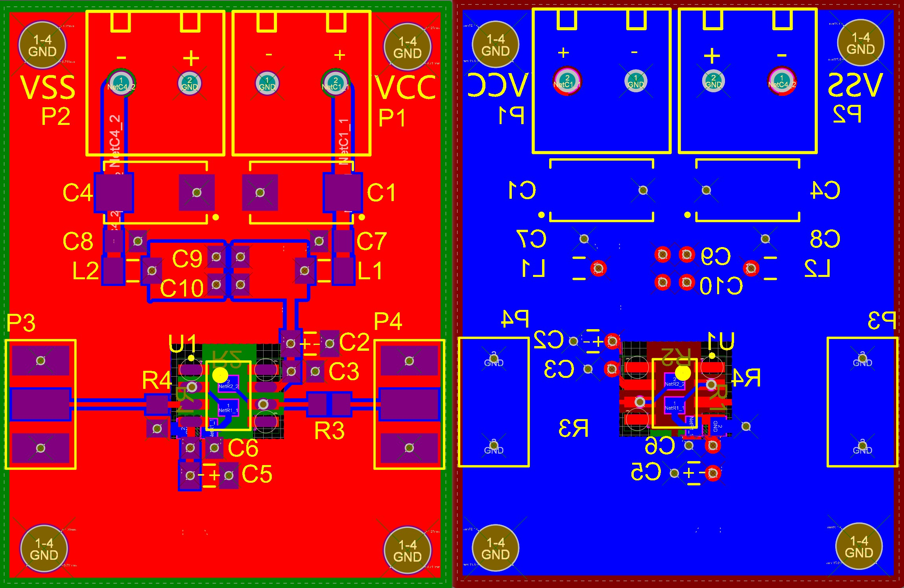   
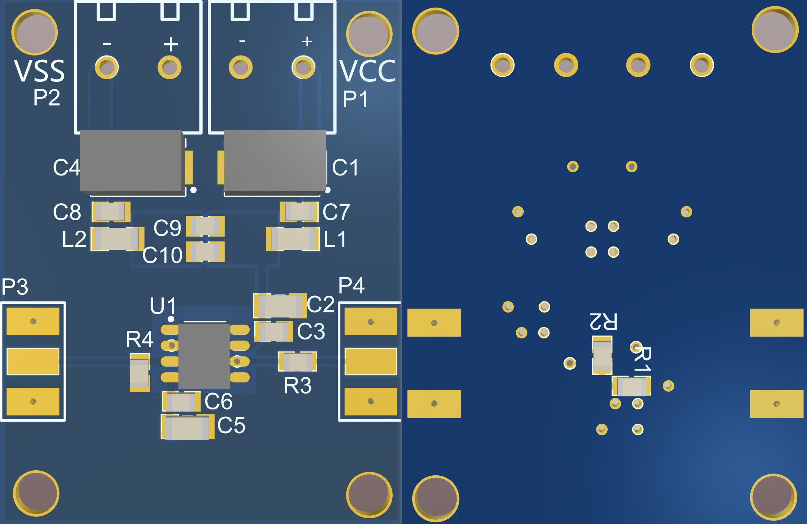  

# 设计经验
+ **通常情况下，如果去耦电容正确放置，去耦电容对电路的影响并不是很大。**    
+ **PCB层数也对一般的电路没有显著影响，如果布局布线合理，双层板和四层半的性能几乎没区别。**   
+ **最重要的一点，反馈信号通路的接地点要与输入信号接地点一致，这种布线具有最小谐波失真。**   

# 未解决的问题   
+ ***为什么反馈信号通路能够影响放大器的性能，能够引入如此大的谐波失真？我觉得应该有理论解释，但是目前为止我还没有找到。***   
+ ***为什么谐波失真能够随信号频率的增加而增加？当输入频率为10MHz时的二次谐波失真要小于输入信号频率为20MHz时的二次谐波失真。***   

# 返回主页
[返回主页](https://yannanzhang512.github.io/YannanZhang/pages/index_cn.html)

