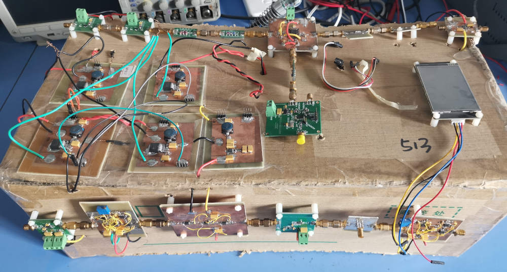
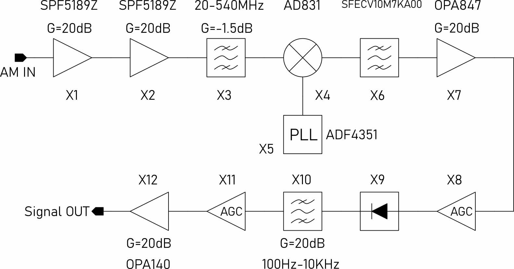
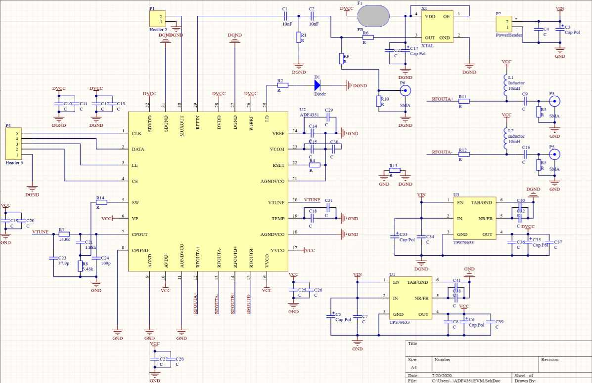
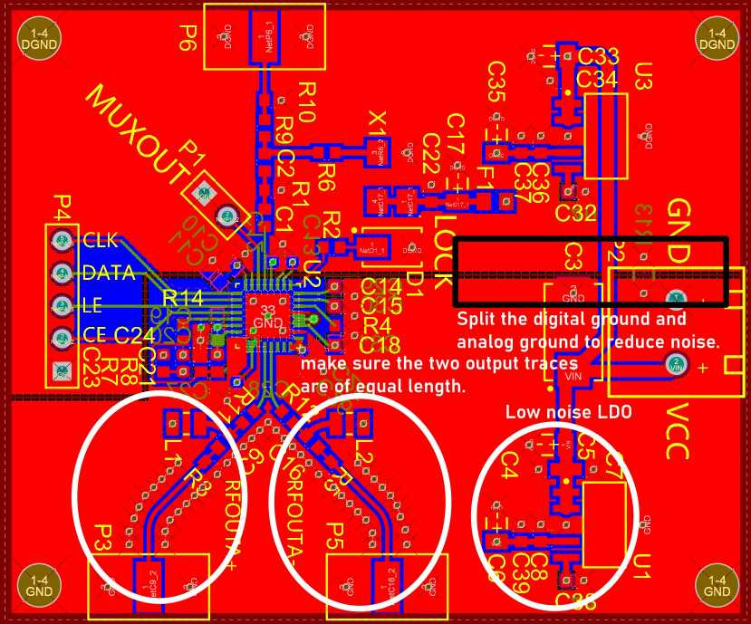
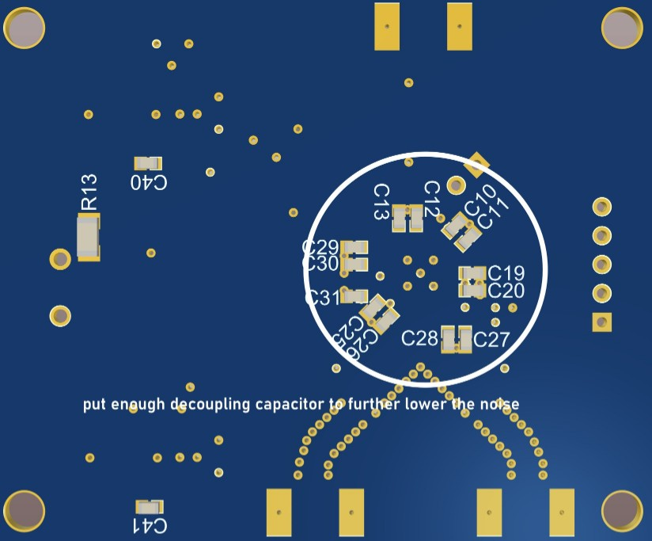
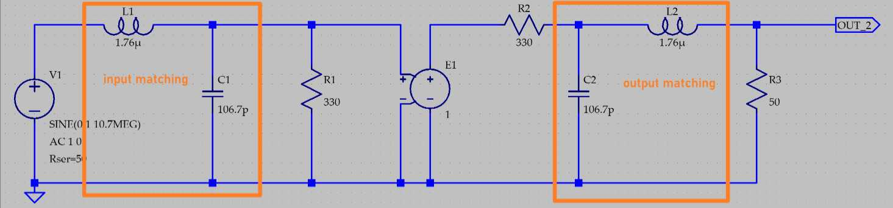

# A 500MHz bandwidth AM receiver with 54dB input dynamic range

# Introduction 
   
**This AM receiver was designed by me during the National Undergraduate Electronic Design Contest, it won the first prize. The input power range is from -101dBm to -47dBm, input frequency range is from 30MHz to 510MHz. Output bandwidth is from 300Hz to 5KHz.**   

# System Block diagram
The system block diagram is shown below:      
  

# Design of the system
## Low noise amplifier

## Mixer

## Phase Locked Loop   
The phase locked loop is implmented using ADI's ADF4351. ADF4351 is a wideband synthesizer with integrated VCO. Its output frequency range is from 35MHz to 4400MHz. Since the IF in this particular system is 10.7MHz, in order to have a 30MHz to 510MHz input frequency range, the PLL should have a output frequency ranging from 40.7MHz to 520.7MHz and ADF4351 is suitable for this application.   
The schematic of ADF4351 is shown below:   
   
The layout of ADF4351's pcb is shown below, to reduce the noise, enough decoupling capacitor should be used and the digital ground and analog ground should be split. Besides, two ultra-low noise LDO TPS79633 are used to power the digital and analog part.   
  
  

## IF Filter
The IF in this system is set to 10.7MHz, since many high performance commercial products are available. In this AM receiver, muRata's SFECV10M7KA00 is used. The electrical characteristics are shown below:   
  
**Since the input/output impedance of SFECV10M7KA00 is 330ohm, to connect with 50ohm system, a matching network should be added to reduce input loss**, the matching network is shown below:   
  

## Auto Gain Control Circuit

# Returen to Homepage
