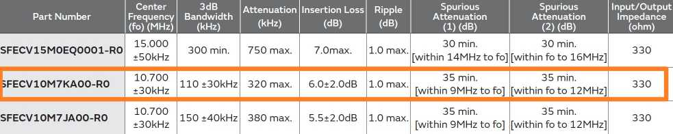

# A 500MHz bandwidth AM receiver with 54dB input dynamic range

# Introduction 
   
**This AM receiver was designed by me during the National Undergraduate Electronic Design Contest, it won the first prize. The input power range is from -101dBm to -47dBm, input frequency range is from 30MHz to 510MHz. Output bandwidth is from 300Hz to 5KHz.**   

# System Block diagram
The system block diagram is shown below:      
  

# Design of the system
## Low noise amplifier
The performance of low noise amplifier is of great importance, since it determines the overall SNR of the system. To achieve the lowest possible NF, the low noise amplifier should have high gain and low noise figure. Qorvo's SPF5189Z was used there, its noise figure can be as low as 0.5dB, with 20dB power gain.   
  
It is noticeable that the Output P1dB is 22.3dBm at 0.8GHz, and the AM receiver is required to accept -47dBm input power. That means, if we want to cascade multiple SPF5189Z stages, the overall gain should not exceed 22.3+47 = 69.3dB, which are three stages. To achieve best linearity, two stages are reasonable, because the maximal output of LNA is 0dBm, we can expect the circuit do not product much distortion.   

## Mixer
  
The mixer AD831 was the only device that I had during the contest, since the maximal working frequency of AD831 is 500MHz, so upper frequency limit of the AM receiver cannot exceed this value too much, which is 510MHz. It is expected to have a larger input frequency range if the mixed can be replaced with a better one.   
The 1dB compression point of AD831 is 10dBm, the maximal input power of AM receiver is -47dBm, so the overall gain before mixer cannot exceed 57dB. Two stages of LNA contributes 40dB gain, a bandpass filter contributes -1.5dB, so the overall gain before mixer is 38.5dB, which is suitable. 
The next consideration of mixer is its minimal LO driving power. The official data shows the minimal input power of LO port is -10dBm, as shown below, and the maximal output power of PLL is 5dBm, so the mixer can work happily.   
  
  

## Phase Locked Loop   
The phase locked loop is implmented using ADI's ADF4351. ADF4351 is a wideband synthesizer with integrated VCO. Its output frequency range is from 35MHz to 4400MHz. Since the IF in this particular system is 10.7MHz, in order to have a 30MHz to 510MHz input frequency range, the PLL should have a output frequency ranging from 40.7MHz to 520.7MHz and ADF4351 is suitable for this application.   
The schematic of ADF4351 is shown below:   
   
The layout of ADF4351's pcb is shown below, to reduce the noise, enough decoupling capacitor should be used and the digital ground and analog ground should be split. Besides, two ultra-low noise LDO TPS79633 are used to power the digital and analog part.   
  
  

## IF Filter
The IF in this system is set to 10.7MHz, since many high performance commercial products are available. In this AM receiver, muRata's SFECV10M7KA00 is used. The electrical characteristics are shown below:   
  
**Since the input/output impedance of SFECV10M7KA00 is 330ohm, to connect with 50ohm system, a matching network should be added to reduce input loss**, the matching network is shown below:   
  

## Auto Gain Control Circuit
The schematic of AGC is shown below. A voltage-controlled gain amplifier VCA810 is used to amplify the input signal. The peak detector formed by high-speed comparator AD8561 is used to detect the peak value of output signal, then the output of peak detector is used to control the VCA810, so that the output is stable.   
  
A single stage of AGC has over 30dB dynamic range, although higher range is achieveable, it could increase the distortion and noise. Since it's required the AM receiver should have 54dB input dynamic range, so two cascade AGC stage are required. The first AGC(X8) stage is used to stablize the IF signal, the second AGC stage is used to stabllize the LF signal.   

# Returen to Homepage
