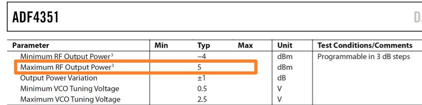
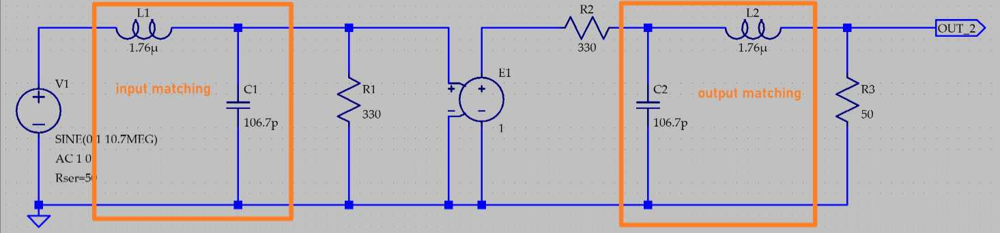

# 54dB输入动态范围，500MHz带宽调幅接收机

# 简介 
   
**本项目中描述的宽带调幅接收机是我在2017年全国大学生电子设计竞赛中带领参赛小组设计制作的，这个作品最终获得了全国一等奖。本调幅接收机的输入信号功率范围为-101dBm 到 -47dBm, 输入调幅波频率范围30MHz 至 510MHz。解调信号带宽300Hz 至 5KHz。**   

# 系统框图
整体系统框图如下所示：      
  

# 系统设计
## 低噪声放大器
低噪声放大器的性能很重要，它决定了系统的信噪比。为了获得尽可能低的噪声系数，低噪声放大器的放大倍数要尽量高，噪声系数要小。本项目中使用Qorvo的 SPF5189Z 作为低噪声放大器，噪声系数只有0.5dB同时提供20dB功率增益。   
  
值得注意的是SPF5189Z的1dB压缩点为-22.3dBm@0.8GHz, 由于AM接收机的最大输入功率为-47dBm，这意味着如果希望使用多级SPF5189Z获得更高增益的话，总增益不能大于-22.3+47 = 69.3dB, 相当于三级级联。为了获得良好的线性度, 两级级联比较合理。两级SPF5189Z级联之后输出功率不大，电路的线性度仍旧很好。   

## 混频器
  
在比赛期间，AD831是我可选用的唯一器件。AD831的最大工作频率为500MHz，此处限制了AM接收机的工作频带上限。AD831的1dB压缩点为10dBm，AM接收机接受的最大信号功率为-47dBm，所以在混频器之前的最大增益不能超过57dB。两级LNA已经贡献约40dB增益，带通滤波器的插入损耗引入-1.5dB增益，总增益为38.5dB，比较合理。由于混频器的本振输入端对输入功率有要求，数据手册指出，最小功率为-10dBm, 如下图所示, 由于锁相环的输出功率最大有5dBm，因此混频器可以正常工作。   
  
  

## 锁相环   
锁相环采用ADI的ADF4351实现。ADF4351是内置VCO的宽带频率合成器，输出频率范围为35MHz 至 4400MHz。由于本系统的中频为10.7MHz，为了使接收机工作在30MHz到510MHz，锁相环输出频率范围要为40.7MHz 至 520.7MHz。      
ADF4351的电路图如下所示：   
   
ADF4351的PCB布局布线如下图所示，为了降低噪声，需要在电路中放置足够的去耦电容。不仅如此，模拟地和数字地需要分开，两个部分分别使用超低噪声的LDO进行供电，LDO选用德州仪器的TPS79633。      
  
  

## 中频滤波器
本系统的中频频率为10.7MHz，由于在这个频点上有很多商品滤波器可以使用，因此能够简化设计。此处使用的是村田的SFECV10M7KA00，电气特性如下图所示：   
  
**由于SFECV10M7KA00的输入输出阻抗为330ohm，为了与50ohm系统实现阻抗匹配，电路中需要使用阻抗匹配网络。阻抗匹配网络的引入能够降低系统插入损耗，提升系统动态范围。**本项目中使用的阻抗匹配网络如下图所示：   
  

## 自动增益控制电路
自动增益控制电路的电路图如下图所示，压控增益放大器VCA810作为核心部件，用来实现可变增益。峰值检波器是由高速比较器AD8561实现的，峰值检波器的输出用来控制压控增益放大器的增益控制端实现自动增益控制。      
  
单级AGC有大越30dB动态范围，实际上可达40dB以上。但是动态范围越大意味着VCA810提供的最大增益越大，同时噪声与失真越大。由于AM接收机需要54dB的动态范围，所以可以采用两级AGC级联的方式。第一级AGC(X8)用于稳定中频信号，第二级AGC用于稳定低频信号。   

# 设计经验
## 中频滤波器的匹配问题
SFECV10M7KA00的输入输出阻抗为330ohm, 为了将中频滤波器与50ohm系统连接，需要引入阻抗匹配电路。10.7M的信号频率虽然不是很高，按经验来讲，即使不进行阻抗匹配问题也不大。但是为了降低系统插入损耗，阻抗匹配网络是必须的。测试结果如下图所示：   
  
如果没有阻抗匹配网络, 中频滤波器的插入损耗为12dB, 当引入阻抗匹配网络后，插入损耗只有6dB。   

## 电源噪声考虑
在本项目中，低噪放，混频器，锁相环等需要多种电源，低噪放需要5V单电源供电, 混频器需要9V单电源供电。由于5V电源是由12V电源经过开关电源转换得到的，所以电源中噪声较大，必须采用适当滤波措施降低电源噪声。下图是未使用电源滤波之前的输出信号波形，可以明显看出信号噪声成分很大。     
  
由于开关电源的噪声很大，输出波形由于噪声印象变得很粗。为了降低电源噪声，可以引入LC pi滤波器，电源噪声就可以大幅减小。      
  

## 注意示波器探头的输入电容
为了测试低噪声放大器的带宽, 我使用射频信号源和示波器做粗略估计。但是实际测试结果显示带宽较小（150MHz），远远达不到数据手册中的标称参数（超过500MHz）。经过仔细分析后我发现，示波器探头存在十几pF的输入电容，它与放大器的输出阻抗形成低通滤波器限制了放大器的带宽。示波器探头大概有13pF电容，同轴线以及其他引线存在几pF的输入电容，总输入电容大致为20pF。低噪声放大器的输出电阻为50ohm，由输入电容和输出电阻构成的低通滤波器截止频率为159MHz, 与实际测试结果很吻合。其中一个解决办法为打开示波器的输入阻抗匹配功能，并匹配到50ohm，这样示波器探头的输入阻抗仅仅不足1pF。第二种解决方法是使用矢量网络分析仪测试带宽。***使用示波器时一定要注意示波器探头的输入电容可能对电路造成的影响。***   

# 返回主页
[返回主页](https://yannanzhang512.github.io/YannanZhang/pages/index_cn.html)

