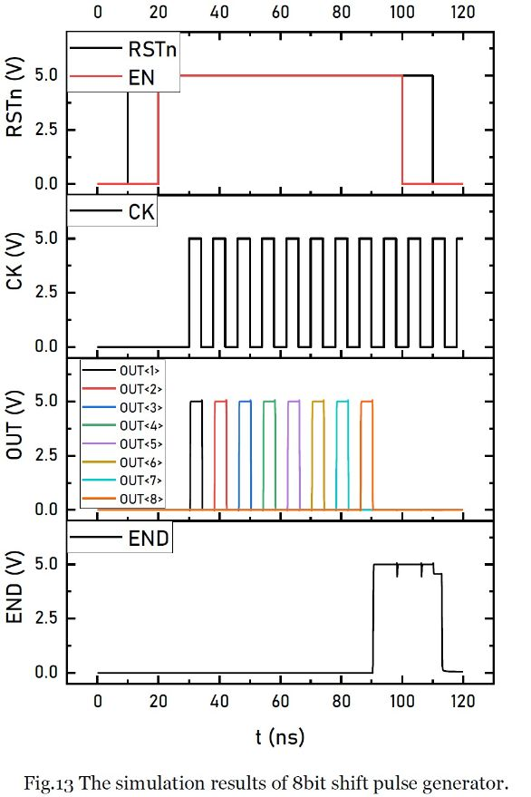

# Asynchronous SAR ADC

# Introduction
**This project was intended to learn how to implement a asynchronous SAR ADC, especially the design of the timing generation logic and control logic. This project does have some my original ideas, for example, I made some changes to the TSPC DFF, besides, the whole 'Asynchronous SAR Logic' section and 'Switching Scheme' section are my original work. This work was supposed to be tested comprehensively, but unfortunately, because my computer's performance limitation (I run the Cadence in virtual machine), it's difficult to include many results such as FFT spectrum as well other time-consuming simulations.**   

# Circuit Implementation
## D Flip-Flop
### Elimination of the output glitches
In SAR ADC, D Flip-Flop is often used to generate proper logic. Traditional D Flip-Flop is slow and power-hungry. To achieve low propagation delay and high speed, TSPC D Flip-Flop is used in this project. However, traditional TSPC DFF has the problem of output glitches, as shown below.   
  
The output glitch may cause wrong logic states. By coupling through any possible paths, the output glitch of traditional TSPC can add extra noise into the circuit. To eliminate the output glitches, I proposed a glitch-free TSPC DFF as shown below. (Few months later, I found this schematic has already been proposed in a patent by Piguet in 1974).   
  
Fig.1 (a) shows the schematic of traditional TSPC DFF, it have output glitches when D=0 and CLK is going through a low to high transition. To eliminate the output glitches of traditional TSPC DFF, transistor M10 has been added into the circuit so that the improved version of TSPC DFF is glitch-free. The schematic of glitch-free TSPC DFF is shown in Fig.1 (b).   
  
Fig.2 shows the waveform of two DFF, including input stimuli and output response. Fig. 2 (a) is obtained when VDD=3.6V, the output of glitch-free TSPC DFF is same as that of traditional TSPC DFF. But the output of traditional TSPC DFF has many glitches when output is low, while the output of glitch-free TSPC DFF is clear. Fig.2 (b) is obtained when VDD=1.2V, the output of glitch-free TSPC DFF is not same as that of traditional TSPC DFF. The detailed waveforms of two DFF with a time span from 75ns to 100ns when VDD=1.2V is shown in Fig. 3. When t=80ns, the clock and D is changing from low to high, so the output of DFF should be low. But according to the result, the output of traditional TSPC DFF is changing from low to high at this time, which is wrong. At low power supply, traditional TSPC DFF cannot behave correctly while glitch-free TSPC DFF is still functional.   
  
### The reset logic of TSPC DFF
The traditional TSPC DFF with reset logic is shown in Fig.4.   
  
However, the reset logic is not reliable, because the floating point (the drain of M4 and M5 is not being properly reset when D=1 and CLK=1. Fig.5 shows the simulation result. At t= 95ns, RSTn is changing from low to high, the Q is expected to remain low, but the result shows a quite different result.   
  
To improve the reliability of the reset logic, a glitch-free TSPC DFF with modified version of reset logic is shown in Fig.6.   
  
Here, M14, M15 and M16 are added to properly reset another floating point, the simulation result shows the glitch-free TSPC DFF with modified version of reset logic can be properly reset, as shown in Fig. 7.   
  

## Dynamic Comparator
The schematic of dynamic comparator used in this project is shown in Fig. 8.   
    
    

## Asynchronous SAR Logic
### Shift Pulse Generator
The shift pulse generator is used to generate a series of pulses to control the corresponding bit of the SAR ADC. A single shift pulse generator is shown in Fig. 10.   
    
Fig. 10 (a) shows the symbol of a single pulse generator, CK pin is used to accept clock signal, RSTn pin is used to reset the whole circuit. When EN pin as well as RSTn pin are high, the OUT pin will output the first clock signal it receives, then the END pin goes high to indicate it has successfully generated a single pulse. The simulation results of a single shift pulse generator are shown in Fig. 11.   
    
By cascading multiple single shift pulse generators, shift pulse generator used in 8bit SAR ADC can be realized. The implementation of 8bit shift pulse generator is shown in Fig. 12.   
    
In Fig. 12, when the former single shift pulse generator has successfully generated a pulse, the END pin goes high, since the END pin connects to the EN pin of the next shift pulse generator, the next one will be enabled to generate a pulse. The simulation results of 8bit shift pulse generator are shown in Fig. 13.   
    
### Self-timing Clock Generator
In asynchronous SAR ADC, the clock used to control SAR logic is not provided by external signal, it can generate a self-timing clock internally. The schematic of self-timing clock generator is shown in Fig. 14.   
    
GT signal is used to control the self-timing clock generator, when GT is low, the output of I2 is high, so the output of I3 is low, which disables the comparator. When GT turns high, the output of I2 is determined by its two input, that are A and C. If the two inputs are both high, which indicate that the comparator is closed or it has not finished its comparison, the output of I2 is low and I3’s output is high, which enable the comparator. Once the comparator gets results, the two outputs are different, the output of I2 will goes high to indicate a successful comparison has been completed, the output of I2 is labelled as COMP_END to be used as a comparison finish signal. Then CLK goes low, the two output of comparator is high, a new circle will start. The simulation results are shown in Fig. 15.   
    
### Timing Generation Circuit
By combining the units mentioned above, the timing generation circuit can be achieved. The timing generation circuit is used to generation self-timing clock, bit control signals as well as comparison finish signal. The schematic of the timing generation circuit is shown in Fig. 16.   
    
When CONVERT is high, it indicates that a conversion circle starts. Since END is low, so GT signal is high, which starts the self-timing clock generation. Eight clock pulses will be generated and when the 8th clock has been generated, the END goes high, so GT goes low, the conversion circle ends. The simulation results of this timing generation circuit are shown in Fig. 17.   
    
## Capacitor Array
The binary capacitor network used in this project is shown in Fig. 18. The smallest capacitors are C1 and C9, which are 2fF; the largest capacitors are C8 and C16, which are 128fF.   
    
## Switching Scheme
### Switching Circuit
    
When SWM is 'high', the capacitor array will be connected to common-mode voltage; when SWP is 'low', the capacitor array will be connected to positive reference voltage; when SWN is high, the capacitor array will be connected to negative reference voltage. The capacitor array can be connected to one voltage or just disconnnected.    
### Switching Logic
    
Fig. 20(a) shows the switching logic used to control the capacitor array connect to common-mode voltage. Fig. 20(b) and (c) show the switching logic used to control the capacitor array connect to reference voltage.   
When ADC is in the sample mode (SAMPLE=1 and CONVERT=0, BitSelect=0, COMP_END=1), the capacitor array should be disconnected from common-mode voltage, positive reference voltage, negative reference voltage. After this, SAMPLE=0, CONVERT=0 and the capacitor array should be connected to common-mode voltage. When ADC is in converting mode, the controlling signal is generated.    
# Simulation Results
**My Cadence is running on a virtual machine and limited by my computer's performance, I can only do short transient simulation. The result is shown below and it functions well.**   
   

# Return to Homepage
[Return to Homepage](https://yannanzhang512.github.io/YannanZhang/)
