# 8位40MSPS异步架构逐次逼近模数转换器设计

# 简介
**本项目的目的是实现一个8位异步架构逐次逼近模数转换器，学习异步时序产生和异步逻辑电路设计。**   

# 电路实现
## D触发器
### 输出毛刺的消除
在SAR ADC中，D触发器用来实现核心逻辑，是很重要的数字逻辑模块。传统D触发器速度较慢，且功耗较大，为了获得低的传输时延和较高的速度，本项目中使用了TSPC D触发器。然而传统TSPC D触发器输出端存在毛刺，这种输出毛刺（如下图所示）可能导致错误的电路逻辑，通过耦合也会增加电路噪声。**为了消除传统TSPC D触发器的输出毛刺，本项目提出了一种无输出毛刺的TSPC D触发器**(在我提出解决方案后，我发现具体电路实现已经在1974年由Piguet提出了，很遗憾).。   
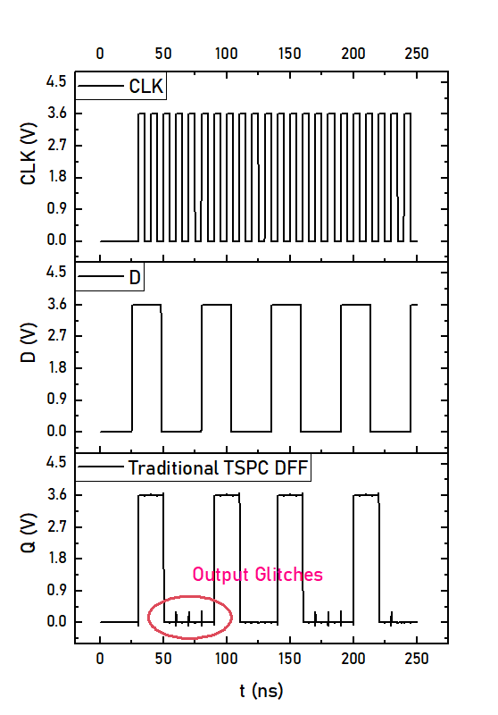  
  
Fig.1 (a)是传统TSPC触发器的电路实现，缺点是输出端存在毛刺（当D=0并且CLK由低到高转换时）。为了消除传统TSPC触发器的输出毛刺，可以**在传统电路实现上增加M10**，如Fig.1 (b)，成为无输出毛刺的TSPC D触发器。   
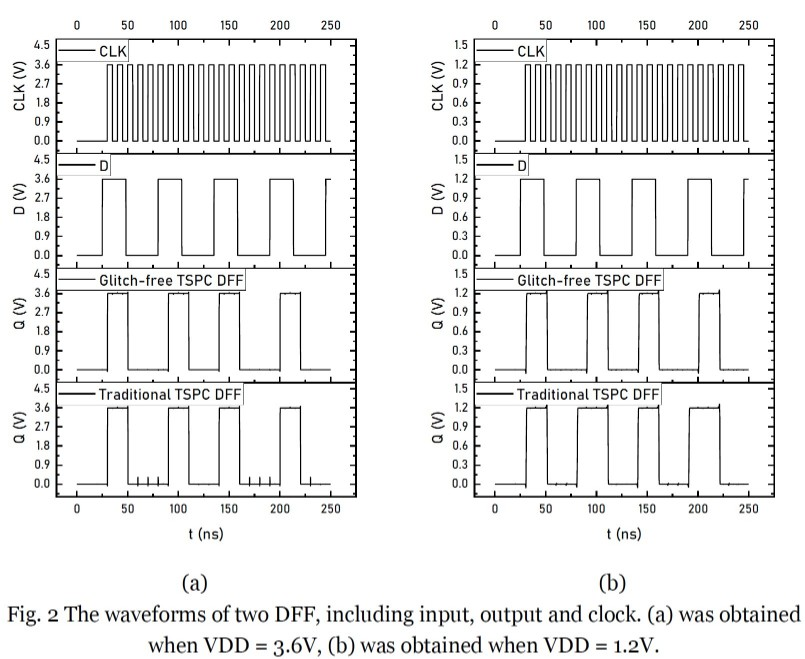  
Fig.2传统TSPC D触发器和无输出毛刺TSPC D触发器的仿真结果。Fig. 2 (a)是当电源电压为3.6V时的仿真结果，传统TSPC D触发器的输出波形与无输出毛刺TSPC D触发器的波形基本一致，区别在于传统TSPC D触发器有输出毛刺，但无输出毛刺TSPC D触发器不存在输出毛刺。Fig.2 (b)是当电源电压为1.2V时的仿真结果，此时传统TSPC D触发器的输出和无输出毛刺TSPC D触发器的输出已经不同。详细的波形对比如Fig.3所示，Fig.3的时间跨度为75ns到100n。当t=80ns时,CLK和D正经历从低至高的转变, 此时触发器应该输出低电平。但是根据仿真结果，传统TSPC D触发器的输出为高，出现了错误逻辑；无输出毛刺的TSPC D触发器输出为低，是正确的结果。**这意味着本项目提出的无输出毛刺型TSPC D触发器不仅可以消除传统TSPC D触发器的输出毛刺问题，同时能够工作在更宽的电源电压范围内。**   
  
### TSPC 触发器的复位逻辑
Fig.4是传统带复位的TSPC D触发器电路图。   
  
但是这种复位方法并不可靠，因为电路中存在浮空节点（M4和M5的漏极），当D=1并且CLK=1时无法被正确复位。Fig.5是对应的仿真结果，当t= 95ns时, RSTn从低变高，输出Q应该仍旧保持低电平，但结果显示输出为高。   
  
为了提升复位逻辑的可靠性，再此修正了传统TSPC D触发器的复位逻辑并合并到无输出毛刺TSPC D触发器中，具体实现电路如图Fig.6所示。   
  
此处增加了M14, M15 和 M16，用来有效复位浮空节点。仿真结果如Fig.7所示。   
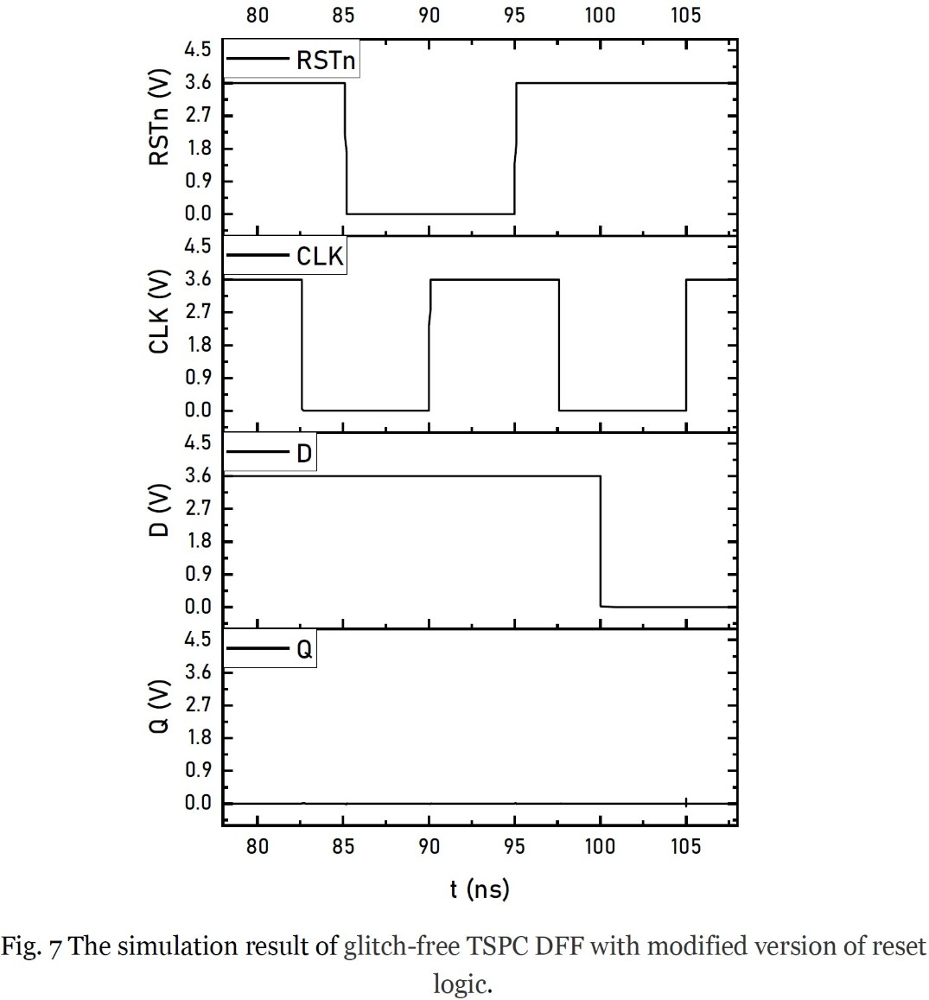  

## 动态比较器
Fig. 8是本项目中动态比较器的实现，Fig.9是仿真结果。   
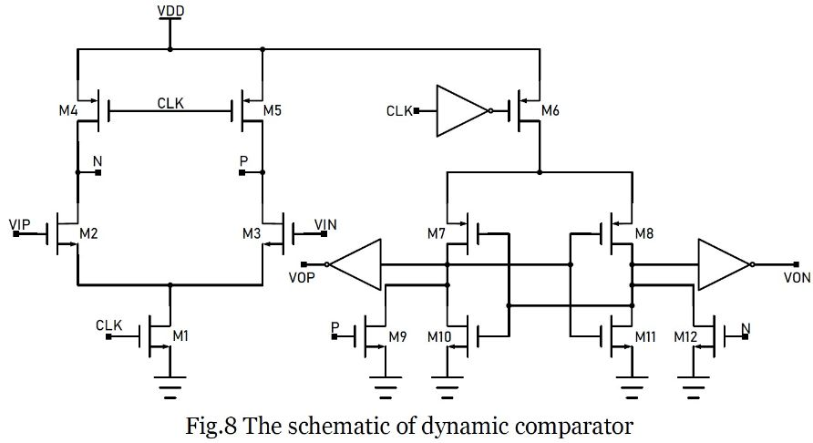    
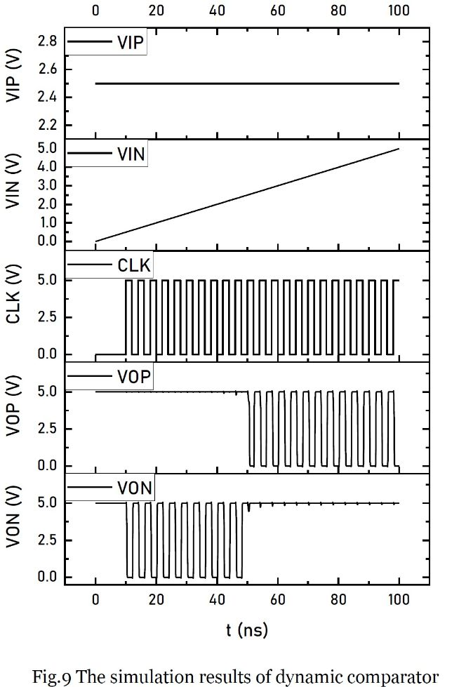    

## 异步SAR逻辑
### 移位脉冲生成
移位脉冲生成器用来产生一系列用来控制SAR ADC单独位的移位脉冲，其电路实现如Fig.10所示。   
    
Fig.10(a)是单个移位脉冲生成器的电路符号, CK引脚是时钟输入引脚，RSTn引脚用来复位电路逻辑。当EN引脚和RSTn引脚为高时，OUT引脚会输出它接收到的第一个时钟脉冲，然后END引脚输出高电平代表已经成功产生了一个移位脉冲。单个移位脉冲生成器的仿真结果如图Fig.11所示。   
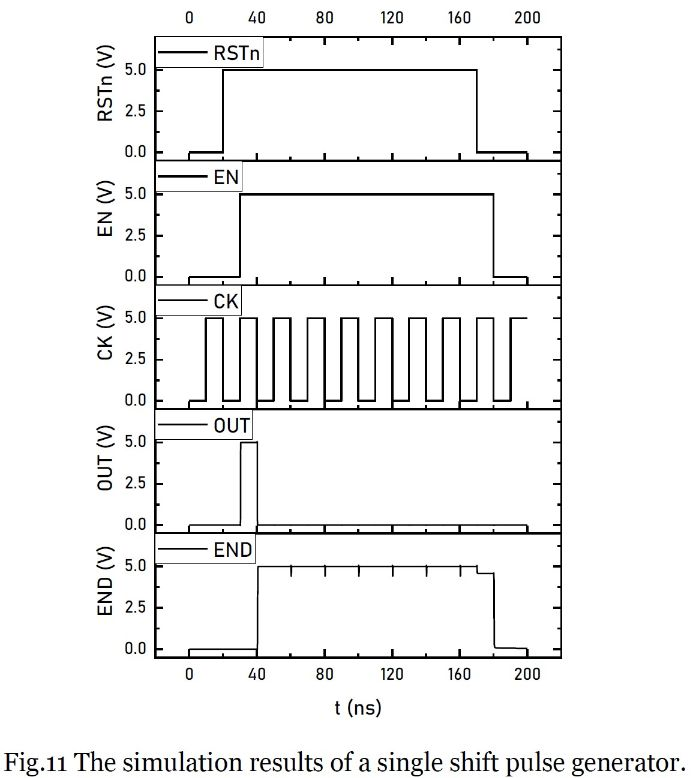    
通过级联多级移位脉冲生成器可以实现用于8位ADC的移位脉冲生成，如图Fig.12所示。   
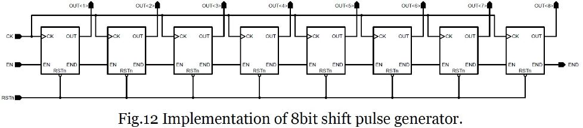    
在Fig.12中, 当前一个移位脉冲生成器输出一个移位脉冲后，它的END引脚输出高电平，由于其END引脚连接到后一个移位脉冲生成器的EN端，所以下一个移位脉冲生成器会被使能，输出一个移位脉冲。Fig. 13是8位移位脉冲生成器的仿真结果。   
    
### 自适应时钟产生电路
在异步SAR ADC中，逻辑时钟并非由外部提供，而是自适应生成，自适应时钟产生电路如图Fig.14所示。   
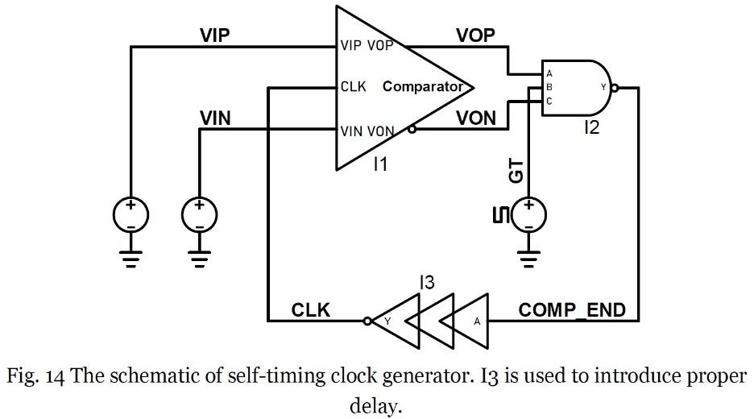    
GT是门控信号，用来控制始终产生，当GT为低时，I2的输出为高，因此I3的输出为低，将动态比较器关闭。当GT信号变高时，I2的输出由两个输入A和C决定。如果两个输入均为高，则意味着动态比较器未使能或是比较过程未完成，I2的输出为低，I3的输出为高，将使能动态比较器。一旦动态比较器比较出了结果，两个输出端必然不同，I2的输出（COMP_END）将会变高意味着一次比较已经完成。然后CLK变低，动态比较器的两输出端为高，一个新的循环开始。上述过程的仿真结果如图Fig.15所示。   
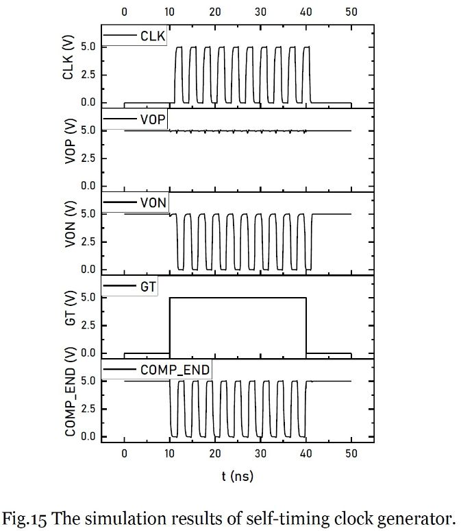    
### 时序产生电路
将移位脉冲生成电路和自适应时钟产生电路结合起来可以构成完整的时序产生电路。时序产生电路用来产生时钟和其他控制信号，其电路图如图Fig.16所示。   
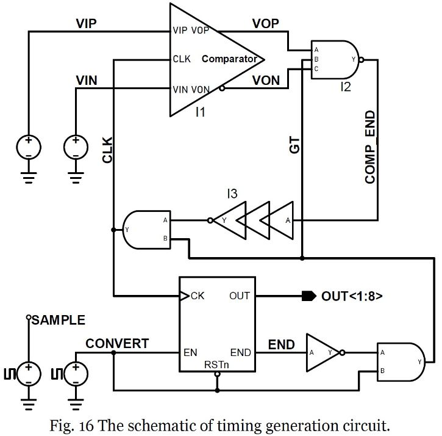    
当CONVERT为高时，意味着转换开始，由于END为低电平，GT信号为高电平，自适应时钟产生电路开始工作并产生8个时钟，当第8个时钟产生后，END信号变高，GT信号变低，转换过程结束。仿真结果如图Fig.17所示。   
    
## 二进制电容阵列
本羡慕中的二进制电容阵列如图Fig.18所示。最小的电容为C1 和 C9，为2fF；最大的电容为C8 和 C16，为128fF。   
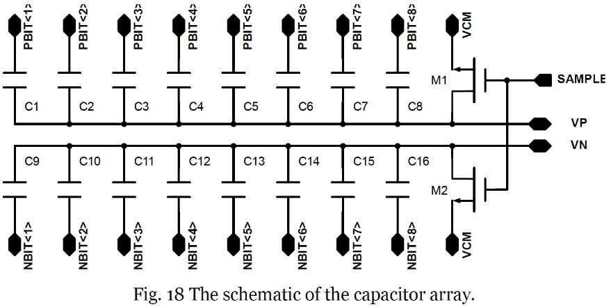    
## 开关方案
### 开关电路
    
### 开关逻辑
    
Fig. 20(a)是用来切换共模电压的开关逻辑电路，fig.20(b) 和 (c)分别是控制切换基准电压的开关逻辑电路。   

# 仿真结果与分析

# 返回主页
[返回主页](https://yannanzhang512.github.io/YannanZhang/pages/index_cn.html)

