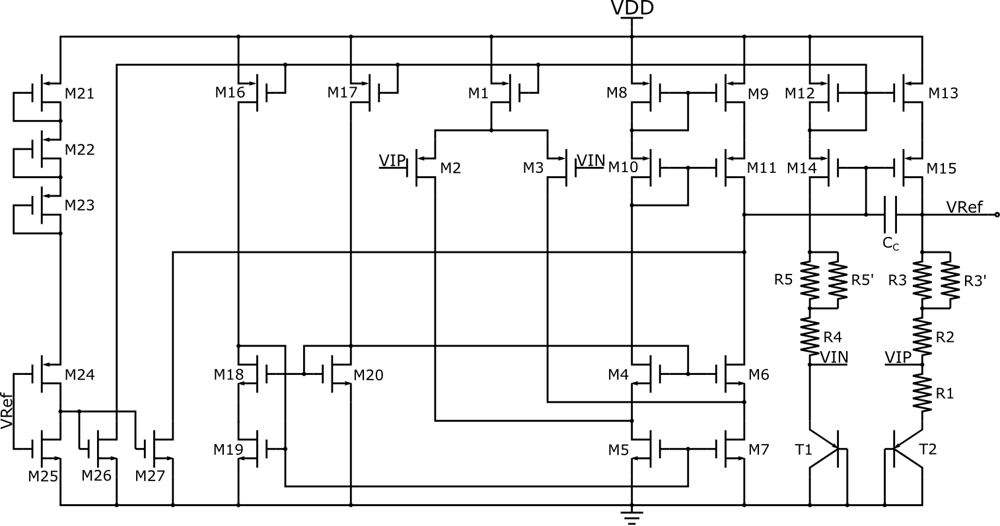
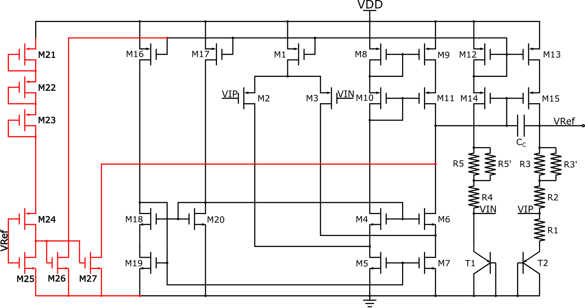

# Bandgap   

# Introduction   
**This project was to learn the basic architecture and design method of a bandgap reference.**   

# Design Method   
## Schematic of the design   
**The Schematic of the bandgap is shown below:**   
   
**The design parameter of the bandgap is shown below:**   
  

## Setting of the quiescent current
To satisfy the power requirement, that is, no more than 200uW power consumption, the quiescent currents are set as follow:   
  

## Calculation of the parameter
### Calculation of Rx
The output voltage Vref and temperature coefficient of Vref can be expressed as follow, since R5=R3, R5'=R3', R4=R2, to simplify the equation, I denote R1=R1, R2=R2, R3=R3//R3'.   
  

The last term of equation 2 is the effect of Resistor's temperature coefficient. In the design, I use HRP poly resistor, its temperature coefficient is shown as follow:   
   

In order to gain zero temperature coefficient, using the data provided,  the value of resistors should have following relation:   
   

Since the dc operating point of T1 and T2 are set to 10uA, and the current are described as follow:   
   

Then the value of R1 is about 5.4065k. A HRP poly resistor with 2 segments, W=2u, L=5u is 5.3525k, and all other resistors can be determined.   

# Simulation Results and Analysis   
## The relation between Vref and Temperature
   
From the results, we can observe that the Vout (Vref) is rather stable when temperature changes except when VDD = 5V. The Vout changes with the changing of power supply voltage. This is because when VDD changes, the open-loop gain of the amplifier also changes since the dc operating points is changing with VDD (I discussed this in the designing experience section). When VDD is increasing from 3V, the open-loop gain of the amplifier is increasing, then the Vout increases towards the ideal value of the bandgap voltage. The open-loop gain reaches peak when VDD is 3.5V~4.0V, and then decreases when VDD continues to increase. The changing of open-loop gain changes the input offset voltage, so the output voltage changes.   

# Conclusion   

# Designing Experience   
+ ***The temperature coefficient of Vbe is not always about -2mV/K***   
The Vbe can be expressed as follow:   
  
From the formula, we can find that the temperature coefficient of Vbe depend on process and current. Using SMIC's 130um process, I simulated the Vbe vs Temperature, the results are shown below:   
  
***The temperature coefficient of Vbe can be different when different current pass through the BE junction, as shown in the results.***   

+ ***The open-loop gain of operational amplifier can be affected by the dc operation point***   
1. The output voltage of amplifier can be determined as follow:   
   
**The last two terms are supposed to remain constant, so the output voltage of amplifier increases when VDD increases.**   
2. The open-loop gain can be determined as follow:   
   
**When VDD is increasing from 3V to higher value, the dc operating point of the amplifier's output is also increasing, so the VDS of M6 is increasing. Since VDS of M6 is increasing, the |VDS| of M11 is decreasing. Increasing of VDS leads to higher ro, so the output resistance of cascode formed by M7 and M6 will increase, the output resistance of cascode formed by M11 and M9 will decrease, while the overall resistance is increasing, thus the open-loop gain is increasing. When VDD continues to increase and reaches above 4V, VD of M6 can approach and exceed 3V, and the substrate leakage of M6 can be dominant which decreases the output resistance of the amplifier, so the overall gain decreases.**   
3. To testify the above analysis, some parameters has been extracted.   
   
In the above table, the cells with orange color represent the output resistance of the cascode structure formed by M3, M7 and M6; the cells with green color represent the output resistance of the cascode structure formed by M9 and M11 and the cells with yellow color represent the resistance cause by the substrate leakage of M6. When VDD increases, the VD6 increases, the ro6 increases substantially, so the open-loop gain increases. But when the VDD exceeds 4V, the substrate leakage of M6 becomes dominant, the equvialent resistance of this effect decreases drastically, causing the open-loop gain to decrease.   

+ ***Start-up Circuitry***   
The start-up circuit should be stable and reliable, and make sure the start-up circuit can help the whole circuit build stable operating point. The start-up circuit in the bandgap is shown below, maked with red line.   
   
The previous version of the start-up circuit is shown below (without M27). This version of start-up circuit cannot start the bandgap successfully. The detailed reasons are as follow: at first, Vref=0, so M24 and M26 pull B to the VDD - |(VGS12 + Vov12)|, since M12 is saturated.   
   

# Return to Homepage   
