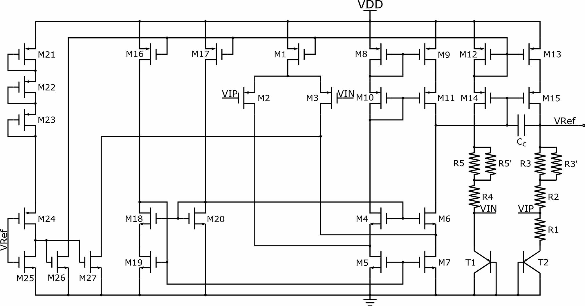
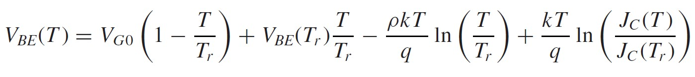
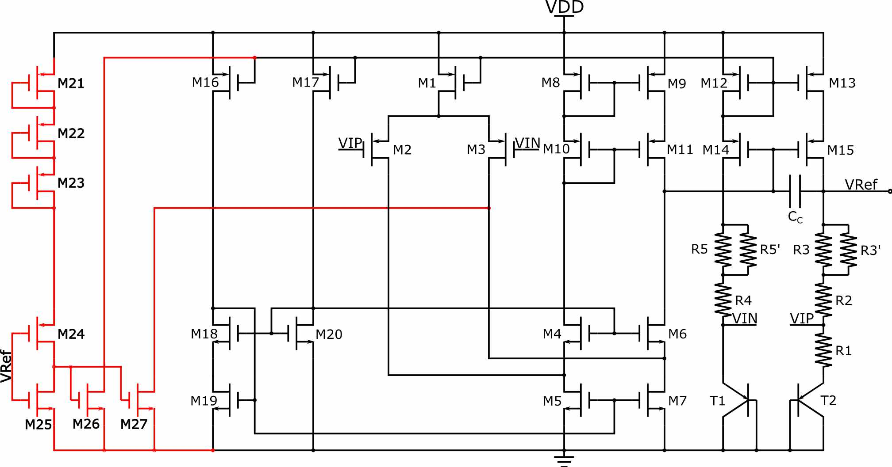

# Bandgap   

# Introduction   
**This project was to learn the basic architecture and design method of a bandgap reference.**   

# Design Method   
## Schematic of the design   
**The Schematic of the bandgap is shown below:**   
   
**The design parameter of the bandgap is shown below:**   
  

## Calculation of the parameter
### Calculation of Rx
The output voltage Vref and temperature coefficient of Vref can be expressed as follow, since R5=R3, R5'=R3', R4=R2, to simplify the equation, I denote R1=R1, R2=R2, R3=R3//R3'.   
  

The last term of equation 2 is the effect of Resistor's temperature coefficient. In the design, I use HRP poly resistor, its temperature coefficient is shown as follow:   
   

In order to gain zero temperature coefficient, using the data provided,  the value of resistors should have following relation:   
   

Since the dc operating point of T1 and T2 are set to 10uA, and the current are described as follow:   
   

Then the value of R1 is about 5.4065k. A HRP poly resistor with 2 segments, W=2u, L=5u is 5.3525k.   

# Simulation Results and Analysis   

# Layout   

# Conclusion   

# Designing Experience   
+ ***The temperature coefficient of Vbe is not always about -2mV/K***   
The Vbe can be expressed as follow:   
  
From the formula, we can find that the temperature coefficient of Vbe depend on process and current. Using SMIC's 130um process, I simulated the Vbe vs Temperature, the results are shown below:   
  
***The temperature coefficient of Vbe can be different when different current pass through the BE junction, as shown in the results.***   

+ ***The open-loop gain of operational amplifier can be affected by the dc operation point***

+ ***Start-up Circuitry***
The start-up circuit should be stable and reliable, and make sure the start-up circuit can help the whole circuit build stable operating point. The start-up circuit in the bandgap is shown below, maked with red line.   
   
The previous version of the start-up circuit is shown below (without M27). This version of start-up circuit cannot start the bandgap successfully. The detailed reasons are as follow: at first, Vref=0, so M24 and M26 pull B to the VDD - |(VGS12 + Vov12)|, since M12 is saturated.   
   

# Return to Homepage   
