# 低功耗高精度电压基准   

# 简介   
**本项目实现了一个简单的低功耗高精度电压基准**   

# 设计方法   
## 整体电路   
**带隙电压基准电路图如下图所示：**   
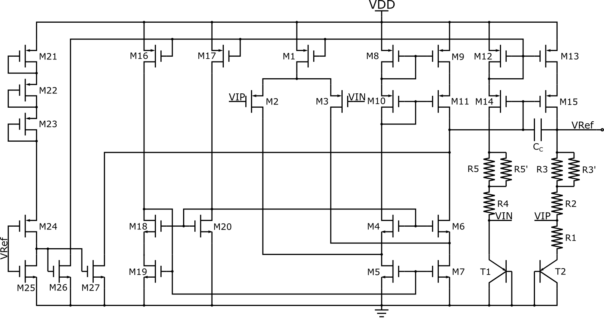   
**本项目中的元器件参数:**   
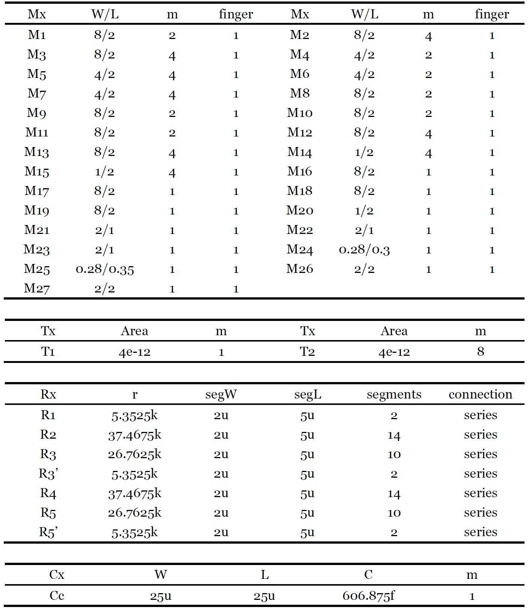  

## 静态电流与工作点设置
为了满足不超过200uW的功耗, 各支路静态电流设置如下:   
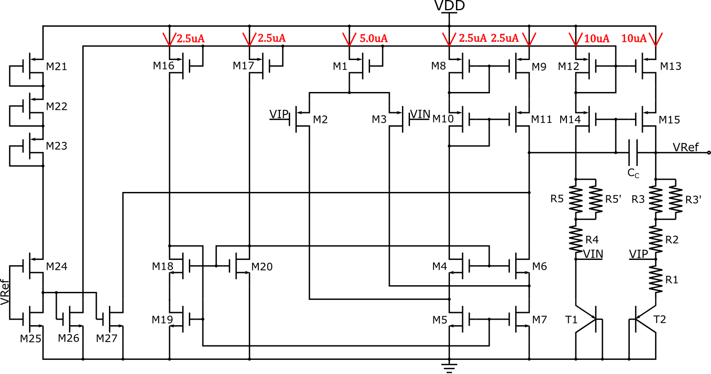  

## 电路参数计算
### 电阻阻值的计算
输出电压Vref和温度系数的表达式如下图所示, 由于 R5=R3, R5'=R3', R4=R2, 为了简化公式, 令R1=R1, R2=R2, R3=R3//R3'.   
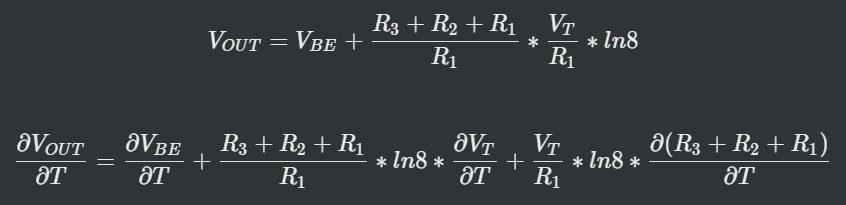  

在上述公式中的第二个公式中，最后一项表征电阻温度系数的影响。在本设计中, 我使用了HRP poly电阻, 根据数据手册所示，其温度系数如下所示:   
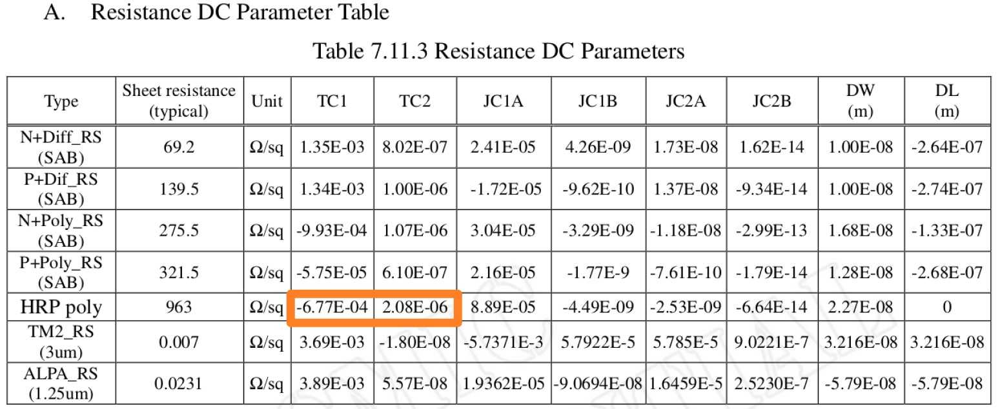   

为了实现尽量低的温漂，参考数据手册中的值，电阻取值必须满足如下条件:   
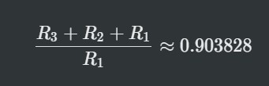   

由于T1，T2的静态电流均设置为10uA, 同时有如下关系:   
   

能够计算出R1的值大概为5.4065k. 2segments，W=2u, L=5u的HRP poly 电阻是5.3525k, 根据此值可以决定其余所有电阻值。   

# 仿真结果与分析   
## 输出电压与温度的关系
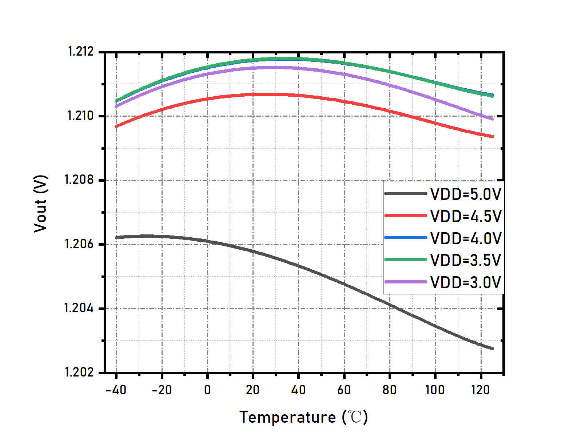   
From the results, we can observe that the Vout (Vref) is rather stable when temperature changes except when VDD = 5V. The Vout changes with the changing of power supply voltage. This is because when VDD changes, the open-loop gain of the amplifier also changes since the dc operating points is changing with VDD (I discussed this in the designing experience section). When VDD is increasing from 3V, the open-loop gain of the amplifier is increasing, then the Vout increases towards the ideal value of the bandgap voltage. The open-loop gain reaches peak when VDD is 3.5V~4.0V, and then decreases when VDD continues to increase. The changing of open-loop gain changes the input offset voltage, so the output voltage changes.   

# Conclusion   

# Designing Experience   
+ ***The temperature coefficient of Vbe is not always about -2mV/K***   
The Vbe can be expressed as follow:   
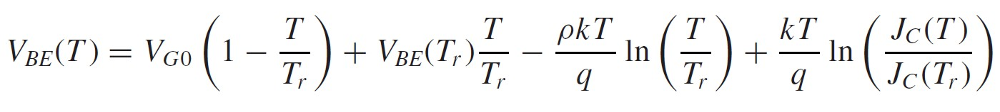  
From the formula, we can find that the temperature coefficient of Vbe depend on process and current. Using SMIC's 130um process, I simulated the Vbe vs Temperature, the results are shown below:   
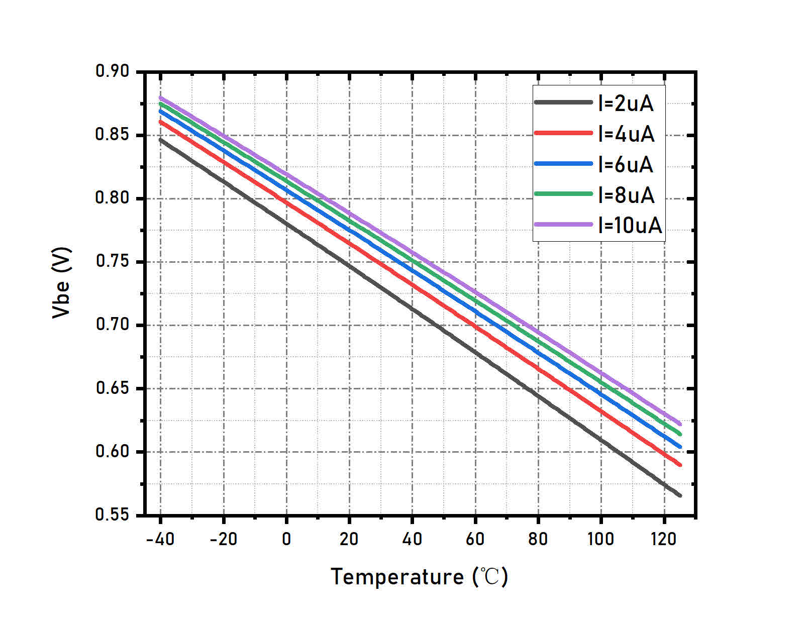  
***The temperature coefficient of Vbe can be different when different current pass through the BE junction, as shown in the results.***   

+ ***The open-loop gain of operational amplifier can be affected by the dc operation point***   
1. The output voltage of amplifier can be determined as follow:   
   
**The last two terms are supposed to remain constant, so the output voltage of amplifier increases when VDD increases.**   
2. The open-loop gain can be determined as follow:   
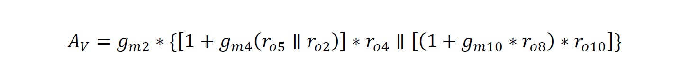   
**When VDD is increasing from 3V to higher value, the dc operating point of the amplifier's output is also increasing, so the VDS of M6 is increasing. Since VDS of M6 is increasing, the |VDS| of M11 is decreasing. Increasing of VDS leads to higher ro, so the output resistance of cascode formed by M7 and M6 will increase, the output resistance of cascode formed by M11 and M9 will decrease, while the overall resistance is increasing, thus the open-loop gain is increasing. When VDD continues to increase and reaches above 4V, VD of M6 can approach and exceed 3V, and the substrate leakage of M6 can be dominant which decreases the output resistance of the amplifier, so the overall gain decreases.**   
3. To testify the above analysis, some parameters has been extracted.   
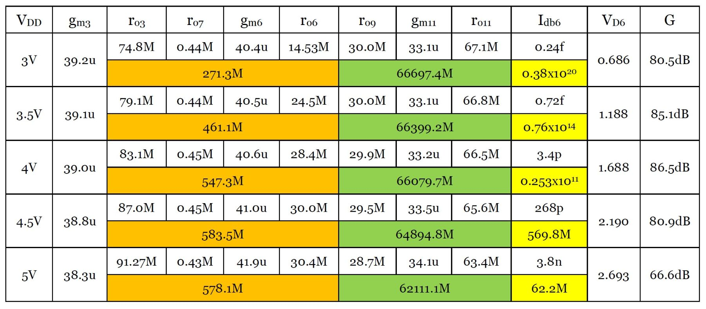   
In the above table, the cells with orange color represent the output resistance of the cascode structure formed by M3, M7 and M6; the cells with green color represent the output resistance of the cascode structure formed by M9 and M11 and the cells with yellow color represent the resistance cause by the substrate leakage of M6. When VDD increases, the VD6 increases, the ro6 increases substantially, so the open-loop gain increases. But when the VDD exceeds 4V, the substrate leakage of M6 becomes dominant, the equvialent resistance of this effect decreases drastically, causing the open-loop gain to decrease.   

+ ***Start-up Circuitry***   
The start-up circuit should be stable and reliable, and make sure the start-up circuit can help the whole circuit build stable operating point. The start-up circuit in the bandgap is shown below, maked with red line.   
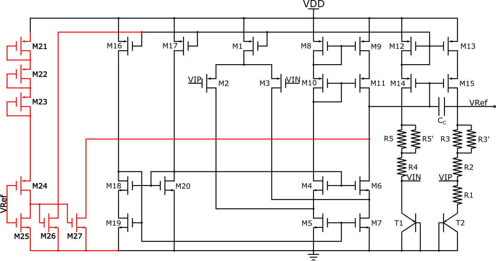   
The previous version of the start-up circuit is shown below (without M27). This version of start-up circuit cannot start the bandgap successfully. The detailed reasons are as follow:   
**At the beginning, Vref=0, the output of the inverter formed by M24 and M25 is high, so M26 turns on and pulls the B point down. The current flows through M12 and M26 is labelled as Istartup. The voltage of point B is VDD - |VTHP + Vov12|, since VTHP is about -0.7V, and Istartup is relatively large, so we can expect that the potential of point B is no larger than VDD - 1V. Second, no matter how much the point A's potential is, the drain current of M14 (Id14) is smaller than that of M15 (Id15), because Vgs14 < Vgs15. Then the potential of VIP is larger than that of VIN. Since the operational apmlifier's non-inverting input has larger potential than its inverting input, the output of operational amplifier will saturated, that means the potential of point A is about VDD - |VDS9|, so point A has larger potential than point B, which means M14 turns off. The key to address this problem is to pull down point A at the same time, which can be achieved by adding M27, as shown in the above figure.**   
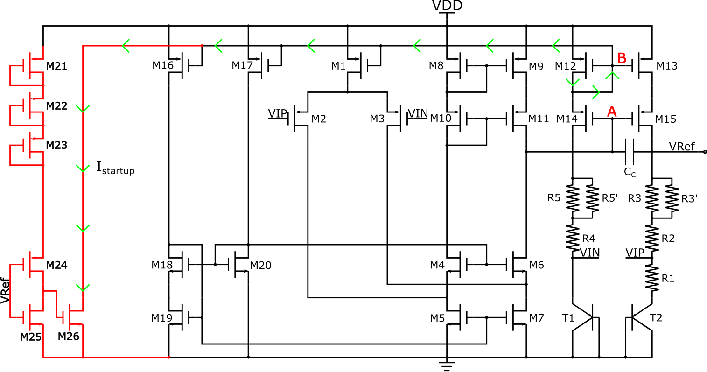   

# Return to Homepage   
