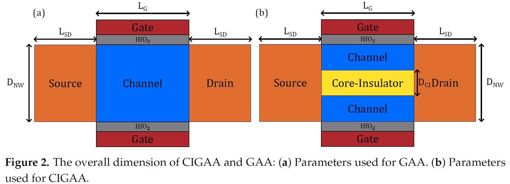
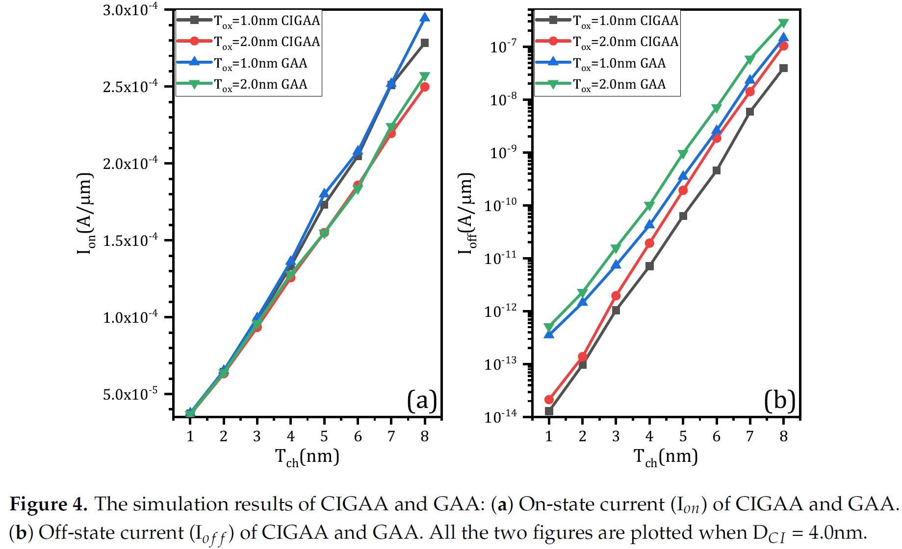

# CIGAA

# Abstract
In this article, a novel Core-Insulator Gate-All-Around (CIGAA) nanowire has been proposed, investigated and simulated comprehensively and systematically based on 3D numerical simulation. By introducing a Core-Insulator into conventional GAA devices (we called it Core-Insulator Gate-All-Around nanowire), the off-state current is expected to be further lowered. Comparisons are carried out between GAA and CIGAA. The new CIGAA structure exhibits low off-state current compares to that of GAA, making it a suitable candidate of future low-power and energy-efficient devices.

# Device Structure and ExperimentMethodology  

## Descriptions of CIGAA Structure   
   
The difference between conventional GAA and CIGAA is that CIGAA structure has a Core-Insulator between the channel, as shown in Figure 1. The material of Core-Insulator can be SiO2, Si3N4 and so on, the impact of different material of Core-Insulator will be addressed in the following paragraph. The channel of CIGAA structure is not a solid cylinder as that of conventional GAA structure, it's a tubular channel. The gate metal should be carefully selected to tune the work function for a particular threshold voltage requirement.   

## Simulation Physical Models
Our simulation platform is Sentaurus TCAD 2017 Version N-2017.09. To describe the current densities of electrons and holes, we introduced Drift-Diffusion model which takes into account the contribution of electron affinity, the band gap as well as the spatial variations of the electrostatic potential. Because the oxide thickness and channel width have reached quantum-mechanical length scales, the wave nature of electrons and holes can no longer be neglected, thus Density-Gradient is used to simulate quantization effects. In order to describe the effects of electron-hole scattering, screening of ionized impurities by charge carriers, and clustering of impurities, Philips Unified Mobility is used. Since HfO2/Silicon interface can lead to a mobility degradation, we also must take this into consideration by including Lombardi Mobility Degradation model. Hurkx Trap Assisted Tunneling models are incorporated to simulate the tunneling effects at such small dimension. Besides, quantum potential model was also taken into consideration. Because the source and drain are highly doped, we use band gap narrowing model to simulate this effect.  

## Structure Parameters Used for Simulation  
   
   
All the parameters of our experiment are shown in Table 1 and Figure 2. Both structures have same diameter as well as doping profiles. For this article, channel length is fixed to 15 nm and the length of drain and source are both fixed to 10nm. The diameter of Core-Insulator is set from 2.0nm to 14nm. The gate dielectric is HfO2, the thickness is shown in table. For comparison, we have also simulated conventional GAA nanowire of the same overall dimensions.   

## Considerations of Workfunction
Ideally, conventional GAA and CIGAA will have different threshold voltage although they have same geometric parameters, since the presence of Core-Insulator will affect the device threshold voltage. In order to better illustrate and compare the performance of two structures, in other words, to have a fair comparison, we must tune their gate workfunction to ensure they have same threshold voltage, so that we can compare their performance by the same benchmark. It's noteworthy that it's hard to tune the workfunction at any desired value in real fabrication process, although it can be easily achieved in TCAD simulation, all we want is to compare the performance difference between CIGAA and GAA under TCAD simulation.   

# Results and Discussions
## Basic Characteristics of CIGAA and GAA
Figure 4(a) shows the result of on-state current (Ion). On-state current of both structures increases linearly when channel thickness (Tch) increases, since the increment of channel thickness means the effective width of channel will also increase. When Tox is same, CIGAA exhibits a slightly lowered on-state current compared with that of GAA. The on-state current degradation of CIGAA is due to the reduction of total volume of channel because of the presence of Core-Insulator which results in smaller effective channel width. But the inversion layer forms closely to the interface of HfO2/Silicon and is extremely thin, the total on-state current only have a small degradation.    
   
Besides, the Figure 5(a) and Figure 5(b) show that the on-state electron density of CIGAA at the HfO2/Silicon interface is much higher than that of GAA, which explains the negligible degradation of on-state current.   
  
Both structures show a increment of off-state current when channel thickness increases, as shown in Figure 4(b). The off-state current of CIGAA is about 2 to 5 times lower than that of GAA, which means CIGAA has the nature to be used to fabricate low-power device. The good performance of off-state current can be clearly explained by examining the electron density plot. Figure 6(a) and 6(b) show the electron density of GAA and CIGAA at off-state (VGS = 0V), respectively. It is evident that both two structures have almost the same electron density distribution in the channel. But when we examine the CIGAA, the inner part of channel where Core-Insulator is located should have the identical electron density distribution with that of GAA if the silicon is not replaced by Core-Insulator, which means that the current path are narrower than that of GAA, resulting in smaller off-state current.    
   
The characteristics of GAA and CIGAA in terms of subthreshold slope, switching ratio and drain-induced barrier lowing are shown in Figure 7(a),(b),(c) respectively. The subthreshold slope of CIGAA always outperform that of GAA when they have the same Tox. Equation (1) can perfectly explain the good results of CIGAA. Due to the reduction of off-state current, while Ion and VDD remain constant, the subthreshold slope is lowered.   
   
   
Since the off-state current are lowered, the switching ratio of CIGAA is expected to be lower than that of GAA, as shown in Figure 7(b).   

## Impact of Core-Insulator Diameter and Material on Device Performance
We have set up experiments to further investigate the impact of Core-Insulator diameter and material on device performance. To simplify the experiments, we fixed the nanowire diameter to 8nm (as shown in Table 2) and the Core-Insulator materials are Si3N4, SiO2 and HfO2.   
   

The results in terms of on-state current and off-state current are shown in Figure 8(a) and Figure 8(b) respectively. Changing of Core-Insulator material only have minor effect on on-state current based on Figure 8(a). In fact, as DCI increases, the impact of Core-Insulator on on-state current become more and more significant. Unlike on-state current, changing of Core-Insulator material have conspicuous influence on off-state current. According to the simulation results (as shown in Figure 8(b)), SiO2 can effectively suppress current flow under off-state, HfO2 is the worst material to achieve low off-state current among the three, Si3N4 is better than HfO2. No matter what the Core-Insulator material is, the on-state current will decrease when DCI increases, since DCI increases means channel thickness decreases which lead to the reduction of effective channel width. Likewise, the off-state current will decrease when DCI increases because larger Core-Insulator helps to suppress off-state current.   
   

As for subthreshold swing, switching ratio and DIBL, increasing DCI result in better performance, as shown in Figure 9(a), (b), (c) respectively. SiO2 can effectively enhance device performance, Si3N4 is less useful than SiO2 and HfO2 is the worst choice. In real fabrication, it's important to decide the DCI according to application requirements. SiO2 is the best material among the three to achieve better performance. Since larger DCI can reduce on-state current, so the first thing to do is to select DCI which enables on-state current to be large enough.    
   

## Impact of Core-Insulator Length on Device Performance
   
Due to the limitations of existing fabrication technology, it's hard to fabricate a device that has a Core-Insulator exactly the same length as its channel, which is shown in Figure 10. So we have to further investigate the impact of Core-Insulator length on device performance. There are two possible situations, one is that the Core-Insulator extends itself into source and drain by Lext, as shown in Figure 10(a). The other is that the Core-Insulator recesses itself into channel by Lext, as shown in Figure 10(b).   
The results are shown in Table 3. A positive Lext represents the situation which is shown in Figure 10(a) and a negative Lext represents the situation which is shown in Figure 10(b). From the results, we can notice that the performance of CIGAA only have slight variations and can be neglected. When Lext changes from -2nm to 2nm, the Core-Insulator extends itself into source, resulting in a volume reduction of channel. That reduction causes the effective channel width to be further lowered, which finally results in a reduction in on-state and off-state current. The simulation results reveal that a small variation in fabrication will not cause noticeable performance degradation.   
  

## Parasitic Capacitance of CIGAA and GAA
One important concern about the newly proposed structure is its parasitic capacitance, since the presence of Core-Insulator may affect the charge distribution of CIGAA. We have investigated the impact of Core-Insulator materials, channel thickness and Core-Insulator diameter on the device's parasitic capacitance. Figure 11(a) and Figure 11(b) show that changing of Core-Insulator material will significantly affect the device's parasitic capacitance. When the Core-Insulator material is HfO2, the gate capacitance is about 3 times larger than that of CIGAA with Si3N4 Core-Insulator, 6 times larger than that of CIGAA with SiO2 Core-Insulator. As channel thickness increases, the gate capacitance will also increase, as shown in Figure 11(a). When Tox is same, CIGAA with SiO2 Core-Insulator shows smallest gate capacitance, while CIGAA with HfO2 Core-Insulator shows largest gate capacitance. Besides, the gate capacitance of CIGAA with SiO2 Core-Insulator and CIGAA with Si3N4 Core-Insulator are lower than that of GAA. When Core-Insulator diameter increases, the gate capacitance of CIGAA increases simultaneously. HfO2 cannot be used as Core-Insulator material, because it provides fairly large gate capacitance. While Si3N4 and SiO2 can be used as Core-Insulator material, SiO2 is the best material among the three, it provides the smallest gate capacitance.   
  

# Conclusion
We have studied the device performance of our proposed CIGAA nanowire using 3D TCAD simulation. Due to CIGAA's lowered off-state current enabled by Core-Insulator, it shows high on-state current, low off-state current, low subthreshold swing and high switching ratio. CIGAA has the potential to be used to fabricate low-power systems. Thus, CIGAA nanowire is a promising candidate to extend CMOS scaling roadmap and future low power CMOS devices.

# Return to Homepage
[Return to Homepage](https://yannanzhang512.github.io/YannanZhang/)
