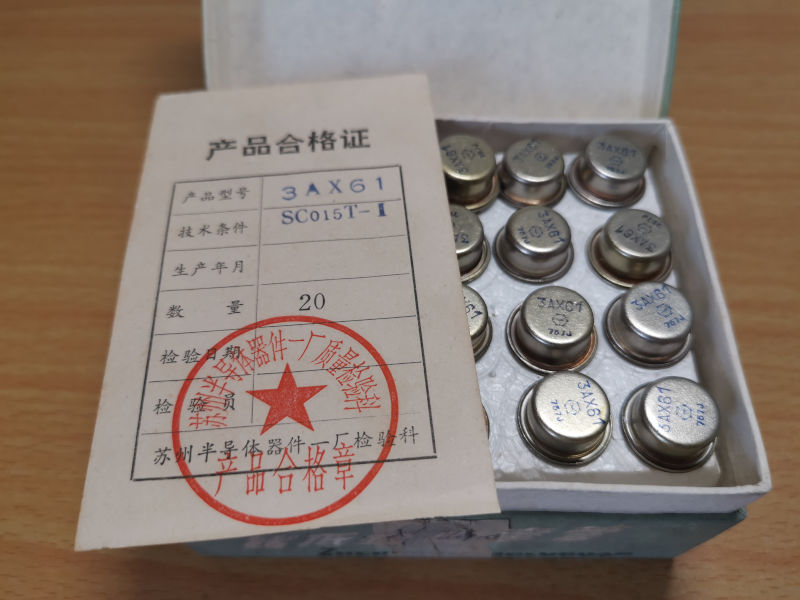
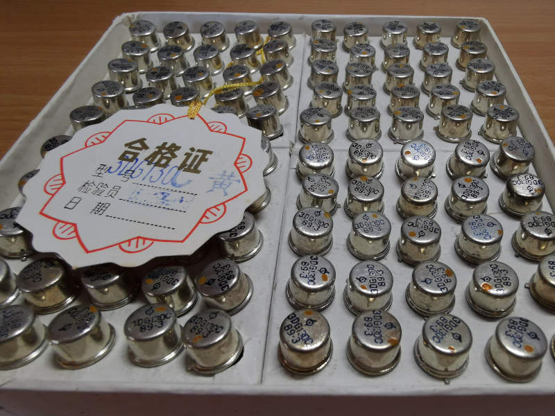
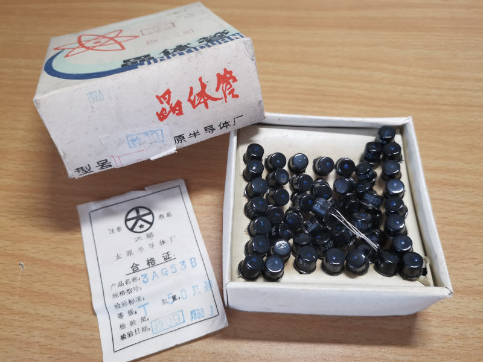
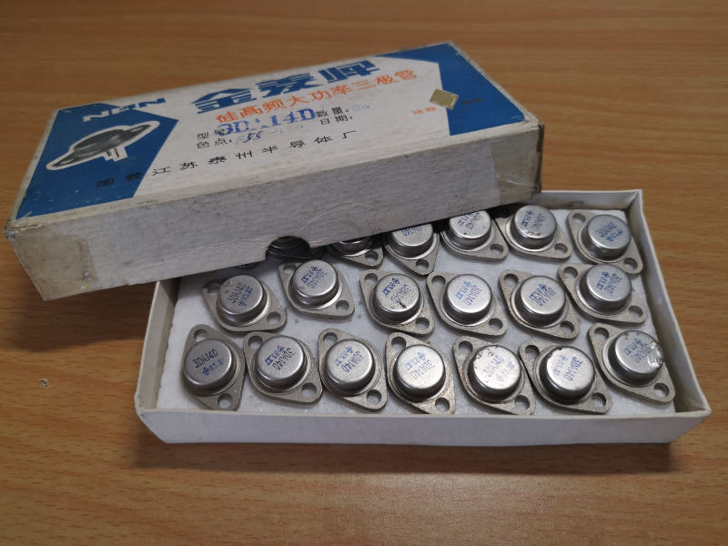
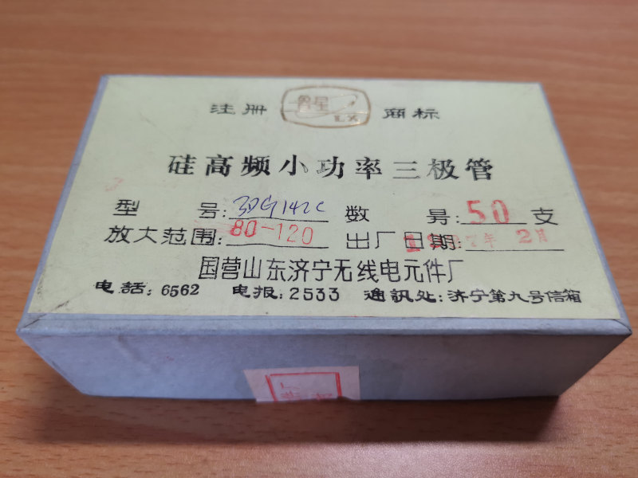

# My Antique Electronic Collection

## Instruments

## Integrated Circuits
+ **ADI's HAS-1202A**   
  
+ **5G23A and FC3B**   
 

## Vacuum Tubes
+ **6P12P**   
   
+ **6Z19**   
   
+ **6U1**   
   
+ **6N3**   
   
+ **6J1**   
   
+ **6P9P**   
   

## Transistors
+ **3AX61**   
   
   
   

+ **3DG130**   
   

+ **3AG53B**   
   
    

+ **3AD14D**   
   
   

+ **3DG142C**   
   
   

## Resistors

## Capacitors

## Inductors
