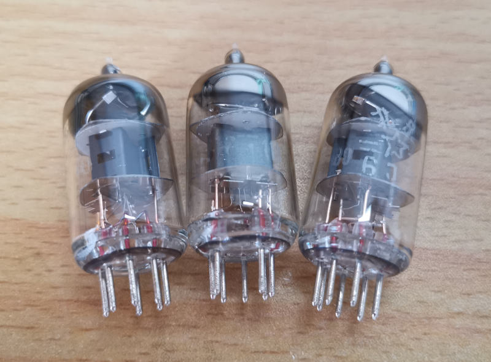

# 我收藏的电子“古董”
***I enjoy collecting all kinds of electronic things, especially chips, transistors, diodes, vacuum tubes and instruments. Some of my collections have witnessed the development of our country's electronic industry, even a small diode emits the scent of history.***   

## Instruments
OOps!   

## Integrated Circuits
+ **AD667, AD0809, AD1674, AD565**   
  
+ **ADI's HAS-1202A**   
***HAS-1202A is ADI's 12Bits Ultra-Fast Hybrid Analog-to-Digital Converter. Its conversion time is 1.2us with an accuracy of 0.012% of F.S. Interestingly, it doesn't have a track-and-hold circuit, so it must be used with an external track-and-hold chip, like HTC-0300.***   
  
+ **5G23A and FC3B**   
***5G23A and FC3B are integrated operational amplifiers made in China in 1977 and 1981 respectively.***   
 

## Vacuum Tubes   
+ **FD-422**   
  
+ **FU-29**   
   
+ **6P12P**   
   
+ **6Z19**   
   
+ **6U1**   
   
+ **6N3**   
   
+ **6N16B**   
 
+ **6J1**   
   
+ **6P9P**   
   

## Transistors
+ **3AX61**   
***3AX61 is a germanium PNP mid-power transistor. It is made in 1975, Suzhou, China.***   
   
   
   
   

+ **3DG130**   
***3DG130 is a silicon NPN mid-power transistor. It is made in 1989. In the past, this model of bipolar transistor were often used in radio and audio amplifier.***   
   
   

+ **3AG53B**   
***3AG53B is a germanium PNP small-power transistor. It is made in Taiyuan, China.***   
   
    
   

+ **3AD14D**   
***3AD14D is a germanium PNP large-power transistor. It is made in 1983, Taizhou, China.***   
   
   
   

+ **3DG142C**   
***3DG142C is a silicon NPN low-power transistor. It is made in 1987, Shandong, China***   
   
   

## Diodes
+ **2AP8B**   
***This model of diode were made in 1979, China.***   
   
   

## Resistors
OOps!   

## Capacitors
OOps!   

## Inductors
OOps!   

## Home Page
[Return to Home Page](https://yannanzhang512.github.io/YannanZhang/)
