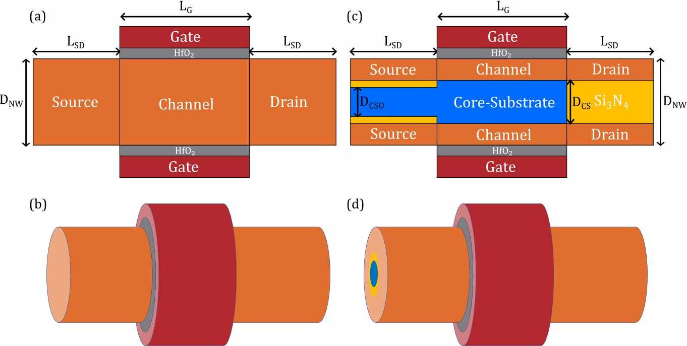
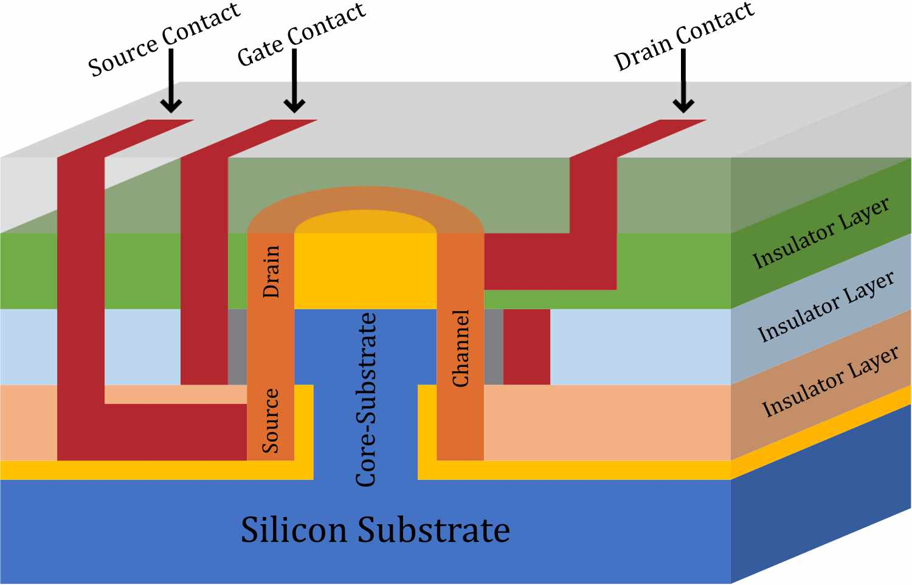

# CSGAA

# Abstract
A novel Core-Substrate Gate-All-Around (CSGAA) nanowire structure has been proposed, investigated and simulated systematically based on 3D numerical simulation. This new structure is characterized by a Core-Substrate directly connected to the substrate wafer or well which is formed by a bulk region inside the tubular channel. Comparisons are carried out between conventional Gate-All-Around (GAA) nanowire transistor and newly proposed CSGAA structure. This budding structure exhibits a maximum of four orders of magnitude of reduction in off-state current, high saturation current and low performance degradation. With the help of Core-Substrate, the CSGAA structure is able to maintain excellent performance despite geometric and structural variation. Its special structure is very suitable for the use of vertical Gate-All-Around nanowire structure, making it a promising candidate of future high performance and low power CMOS devices.

# Description of newly proposed CSGAA structure   
## Cross-sectional view and 3D view   
The schematic cross section and 3D structure of conventional GAA and CSGAA are shown below. The CSGAA structure has a Core-Substrate between the channel, as shown in (c). The Core-Substrate should be highly doped in order to form a low resistance path which will be connected to the well or wafer substrate, and CSGAA is actually a four terminal device while conventional GAA is a three terminal device, that's the key difference between the two structures.   
   

## Possible configuration   
The possible configuration of CSGAA is shown below. In application, the Core-Substrate is often connected to the well or substrate. CSGAA is better to be used as vertical configuration. The Core-Substrate should be attached or connected to wafer substrate or well (P-well for NMOS, N-well for PMOS). There is no need to form a Core-Substrate contact, only drain, source and gate contact are needed.   
  

# Simulation Models
Our simulation platform is Sentaurus TCAD 2017. We performed the calibration of the device simulations using the Advanced Calibration set in Sentaurus Device. To ensure proper and accurate calibration, we refered to some reference projects that are available from TCAD Sentaurus Version N-2017.09 installation. Drift-Diffusion model which takes into account the contribution of electron affinity, the band gap as well as the spatial variations of the electrostatic potential is used to describe the current densities for electrons and holes. Since pure drift-diffusion model is not accurate enough beyond nanometers, and ballistic transport effects must be considered, we also incorporated ballistic mobility models. Because the oxide thickness and channel width have reached quantum-mechanical length scales, the wave nature of electrons and holes can no longer be neglected, thus Density-Gradient is used to simulate quantization effects. In the high channel doping region, IAL mobility (Inversion and accumulation layer mobility) model is used to model 2D Coulomb scattering. Since HfO2/Silicon interface can lead to a mobility degradation, we also must take this into consideration by including Lombardi Mobility Degradation model. Hurkx Trap Assisted Tunneling models are incorporated to simulate the tunneling effects at such small dimension. Besides, quantum potential model was also taken into consideration. Because the source and drain are highly doped, we use band gap narrowing model to simulate this effect.

# Results and Discussions
## Basic characteristics

## Parasitic capacitance and RF performance

## Impact of Core-Substrate diameter on device performance

## Impact of Core-Substrate’s high electric field effect

# Return to Homepage
