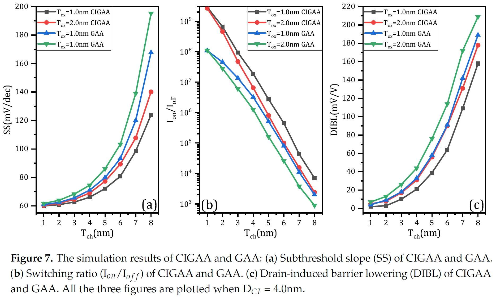
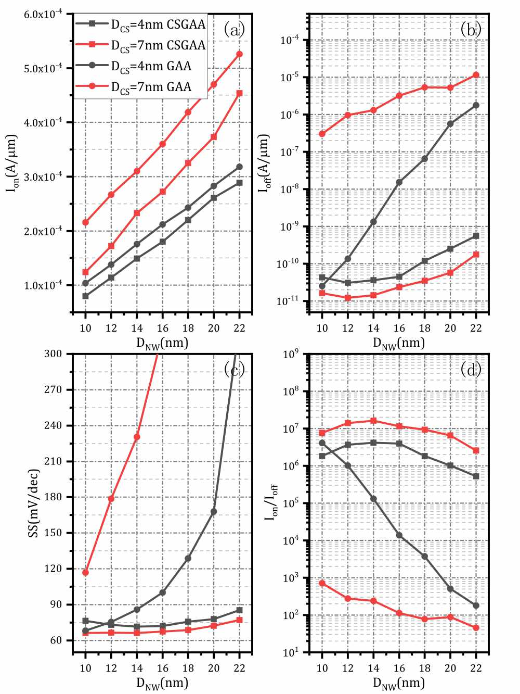
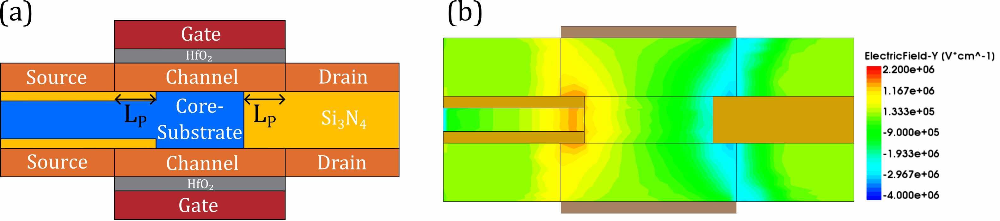

# CSGAA

# Abstract
A novel Core-Substrate Gate-All-Around (CSGAA) nanowire structure has been proposed, investigated and simulated systematically based on 3D numerical simulation. This new structure is characterized by a Core-Substrate directly connected to the substrate wafer or well which is formed by a bulk region inside the tubular channel. Comparisons are carried out between conventional Gate-All-Around (GAA) nanowire transistor and newly proposed CSGAA structure. This budding structure exhibits a maximum of four orders of magnitude of reduction in off-state current, high saturation current and low performance degradation. With the help of Core-Substrate, the CSGAA structure is able to maintain excellent performance despite geometric and structural variation. Its special structure is very suitable for the use of vertical Gate-All-Around nanowire structure, making it a promising candidate of future high performance and low power CMOS devices.

# Description of newly proposed CSGAA structure   
## Cross-sectional view and 3D view   
The schematic cross section and 3D structure of conventional GAA and CSGAA are shown below. The cross-sectional view and 3D view of GAA are shown in (a) and (b) respectively. The cross-sectional view and 3D view of GAA are shown in (c) and (d) respectively. The CSGAA structure has a Core-Substrate between the channel, as shown in (c). The Core-Substrate should be highly doped in order to form a low resistance path which will be connected to the well or wafer substrate, and CSGAA is actually a four terminal device while conventional GAA is a three terminal device, that's the key difference between the two structures.   
   

## Possible configuration   
The possible configuration of CSGAA is shown below. In application, the Core-Substrate is often connected to the well or substrate. CSGAA is better to be used as vertical configuration. The Core-Substrate should be attached or connected to wafer substrate or well (P-well for NMOS, N-well for PMOS). There is no need to form a Core-Substrate contact, only drain, source and gate contact are needed.   
  

# Simulation Models
Our simulation platform is Sentaurus TCAD 2017. We performed the calibration of the device simulations using the Advanced Calibration set in Sentaurus Device. To ensure proper and accurate calibration, we refered to some reference projects that are available from TCAD Sentaurus Version N-2017.09 installation. Drift-Diffusion model which takes into account the contribution of electron affinity, the band gap as well as the spatial variations of the electrostatic potential is used to describe the current densities for electrons and holes. Since pure drift-diffusion model is not accurate enough beyond nanometers, and ballistic transport effects must be considered, we also incorporated ballistic mobility models. Because the oxide thickness and channel width have reached quantum-mechanical length scales, the wave nature of electrons and holes can no longer be neglected, thus Density-Gradient is used to simulate quantization effects. In the high channel doping region, IAL mobility (Inversion and accumulation layer mobility) model is used to model 2D Coulomb scattering. Since HfO2/Silicon interface can lead to a mobility degradation, we also must take this into consideration by including Lombardi Mobility Degradation model. Hurkx Trap Assisted Tunneling models are incorporated to simulate the tunneling effects at such small dimension. Besides, quantum potential model was also taken into consideration. Because the source and drain are highly doped, we use band gap narrowing model to simulate this effect.

# Results and Discussions
## Basic characteristics
### Ion and Ioff  
The characteristics of GAA and CSGAA in terms of on-state and off-state current are shown below. Both structures increase their on-state current linearly when nanowire diameter is increased. Conventional GAA structure slightly outperform CSGAA structure in terms of on-state current. The reason of on-state current degradation of CSGAA is due to the reduction of total volume of channel because of the presence of Core-Substrate which results in smaller effective channel width. The area of the cross section which is also the cross section of current density is reduced either. Such an effect causes a reduction in saturation current, but because most of the current density flows close to the surface of HfO2 and Silicon, the total saturation current only have a slight degradation. As for off-state current, both of the two structure show a performance deterioration as nanowire diameter is increased. As the nanowire diameter is increased, the off-state current of GAA increases dramatically to about 4 orders of magnitude, causing severe degradation in performance. In contrast, the off-state current of CSGAA increases only by 10 times.   
  
The performance  enhancement in off-state current can be easily explained using off-state electron density plot. The off-state electron density of CSGAA and GAA along the channel are shown below. Data was obtained when VGS = 0 V. (a) to (d) show the electron density of CSGAA when VDS = 0 V, 0.3 V, 0.6 V, 0.9 V respectively. (e) to (h) show the electron density of GAA when VDS = 0 V, 0.3 V, 0.6 V, 0.9 V respectively. When same voltage is applied to drain and source, the electron density in the channel of CSGAA structure is much lower than that of GAA, especially at the area where it is far from the oxide-channel surface. The Core-Substrate can help gate gain more control over the channel, it helps to prevent the current from flowing through the channel when the device is off.  Because of this, off-state current of CSGAA is much lower than that of GAA.   
  
### Subthreshold swing and switching ratio   
The characteristics of GAA and CSGAA in terms of subthreshold swing and switching ratio are shown below. The subthreshold swing of GAA increased rapidly due to large off-state current and poor electrostatic control. The subthreshold swing of GAA reached an almost unacceptable value of more than 90 mV/decade when nanowire diameter is larger than 16nm. Whereas the subthreshold swing of CSGAA is no more than 90 mV/decade even if the nanowire diameter is as large as 22 nm. Because of the ultra low off-state current, although there is a slight reduction in on-state current, the switching ratio of CSGAA is fairly large which is benefit from excellent electrostatic control of gate and Core-Substrate. Due to a severe aggravation in off-state current, the switching ratio of GAA deteriorated significantly as the nanowire diameter increased. When nanowire diameter has reached a value larger than 14nm, the switching ratio of GAA is smaller than 10^6 and degrades exponentially, however, the switching ratio of CSGAA is never smaller than 7x10^5.   
  
### DIBL
Below shows the relation between DIBL and nanowire diameter. The DIBL value of CSGAA does not cross 75mV/V for the simulated cases, whereas the DIBL value of GAA increases to almost 300 mV/V. The presence of Core-Substrate not only lowers the off-state current but also enhances the control of gate over channel. By a combined effect of gate and Core-Substrate, threshold voltage remains almost the same even thought the drain voltage increased.   
  

The good controllability of CSGAA can be explained by examining its on-state electron density plot. The on-state electron density of CSGAA and GAA along the channel are shown below. Along the channel, the electron density of CSGAA structure is almost the same (the figure annotated with (b),(c),(d),(e),(f),(g)), as shown in the first figure. It means the gate perform excellent gate control integrity and consistence over the whole channel. But the electron density of GAA structure is varied along the channel (the figures annotated with (b),(c),(d),(e),(f),(g)), as shown in the second figure, which means the gate cannot control all the part of channel and it will lead to larger off-state current, subthreshold swing value as well as switching ratio.   
   
   

The results of subthreshold swing, switching ratio and DIBL testify the superior performance and controllability of gate to that of GAA. Although CSGAA structure has a slightly low on-state current compared to the GAA structure, its off-state current is extremely low. When using multi-wire configuration, its advantage can be clearly seen, because CSGAA structure can achieve a large on-state current by simply increase its channel thickness without much performance degradation. CSGAA structure is less sensitive to scaling and can achieve more drive current by increasing channel thickness, while maintaining relatively stable performance.   

## Parasitic capacitance and RF performance  
### Parasitic capacitance
Because of the presence of Core-Substrate, the parasitic capacitance of CSGAA is expected to be higher than that of GAA. The schematic of various capacitance components of GAA and CSGAA can be clearly seen from figure below.   
  

Below shows the Cgg dependence on channel thickness of two structure, the Cgg makes almost no difference between CSGAA and GAA, the maximal gate capacitance increment of CSGAA is only 5% of that of GAA. We also investigated the impact of Core-Substrate diameter on gate capacitance. The simulated results show that gate capacitance increases linearly when the diameter of Core-Substrate increases linearly.   
  

We use CMOS inverter circuit to further examine the impact of gate capacitance increment of CSGAA on device performance. GAA-based inverter and CSGAA-based inverter are used to evaluated their pulse response, input pulse is provided by voltage source with 40ps period and 1ps rising and falling time, supply voltage is 1.5V. The transient responses of GAA-based inverter and CSGAA-based inverter for an input signal pulse are shown below, and (b), (c) are the detailed figure of transient response. The CSGAA-based inverter shows no more than 2ps propagation delay due to higher intrinsic gate capacitance.   
  

### RF performance   
Research into Analog/RF performance of nanowire transistors becomes more and more important since increased interest of combining analog part and digital part into a single IC. The main figure of merits (FoMs) of Analog/RF performance are transconductance (gm), output resistance (ro), intrinsic gain(gm/gds), transition frequency (ft) and transconductance efficiency (gm/Id).   

Figure shown below illustrates transconductance (gm) and output resistance (ro) for CSGAA and GAA with different nanowire diameters respectively. From (a) we observe that the transconductance of GAA is higher than that of CSGAA by about 13%. Both GAA and CSGAA increase their transconductance when nanowire diameter increases. And from (b) we observe that the output resistance of CSGAA is higher than that of GAA by about 25%. Since higher output resistance represents larger Early voltage, thereby a better channel length modulation effect and better gate controllability.   
   

Intrinsic gain is the maximal possible gain of a single transistor and higher intrinsic gain is favorable for lower noise figure, lower power dissipation and reduced system complexity. The intrinsic gain is obtained by ac device simulation with the TCAD tool, as shown below. Benefit from larger output resistance, the intrinsic gain of CSGAA is larger than that of GAA by about 2 dB, although the transconductance of CSGAA is inferior to that of GAA. The intrinsic gain of GAA and CSGAA decrease with increasing nanowire diameter, because increased nanowire means thicker channel which lead to lower transconductance and output resistance.   
The transition frequency are extract when h21 equals 1 and is shown below. Increasing nanowire diameter means higher transition frequency, this is because the transconductance is increased when increasing nanowire diameter. Due to relatively higher transconductance, the transition frequency of GAA is higher than its opponent by about 14.5%.   
  

The transconductance efficiency of CSGAA and GAA is shown below. Higher transconductance efficiency means higher transconductance at a certain drain current. Although GAA has a higher transconductance, but the on-state current of GAA is also higher than that of CSGAA. In fact, the CSGAA's transconductance efficiency is larger than that of GAA by an average of 5%.   
  

## Impact of Core-Substrate diameter on device performance   
The distinctive feature of CSGAA is its Core-Substrate, thus, it's necessary to investigate the impact of Core-Substrate diameter on device performance. We conducted another experiment by setting the Core-Substrate to 7nm, and the simulation results are shown below. 
  
When other dimension remains the same, we can naturally expect that as the Core-Substrate diameter increases, the performance of two structure will degenerate since larger overall diameter of nanowire leads to worse gate controllability. And our expectations are proved in the simulation results. Due to the poor gate controllability of GAA at such large diameter, the off-state current of GAA is about 10^4 times larger than that of CSGAA which has a 7nm Core-Substrate diameter when channel thickness is 9nm. Besides, the subthreshold swing of GAA is never lower than 110mV/dec when DCS=7nm, which is totally unacceptable. And the switching ratio of GAA degrades to a low level of no more than  10^3. Contrary to the GAA, although CSGAA also shows performance degradation, it's insignificant. From the results, it's obvious that the off-state current, subthreshold swing and switching ratio remain fairly stable no matter how much the diameter of Core-Substrate is. Although the diameter of Core-Substrate is changed, the performance of CSGAA is always excellent, which is another convincing evidence of its superior gate controllability.   
When we increase the Core-Substrate diameter, the transconductance as well as output resistance of the device also increase, as shown below. The increase of gm and ro lead to higher intrinsic gain. Although the device's transconductance increases with Core-Substrate diameter, the gate capacitance also increases with Core-Substrate diameter, which results in a degradation in transition frequency. Finally, the transconductance efficiency almost remain the same because the transconductance and on-state current increase simultaneously.    
  
  
  

## Impact of Core-Substrate’s high electric field effect   
The CSGAA has highly doped N region and P region which are in close proximity, the corner between Core-Substrate and Source or Core-Substrate between Drain can result in high electric field which lead to reliability problems. In order to reduce the electric field, we shorten the Core-Substrate's length by LP to provide a protection length. (c) shows the electric field of CSGAA and (d) shows the electric field of an improved version of CSGAA. Due to the presence of drastic doping profile and sharp corner in close proximity, the electric field of CSGAA at the areas which are shown by red circle and blue circle in (c) are high and may lead to reliability problems. When the length of Core-Substrate is reduced by $L_{P}$, as shown in (b), this improved CSGAA can shows better reliability since the electric field is considerably lowered, as shown in (d).   
   
Since it's easier to fabricate a symmetrical structure, so the improved version of CSGAA , which is shown in (b), can be further improved by extend the insulator of source side into Core-Substrate by the same LP, as shown below. We have also studied the impact of LP on the performance of CSGAA, the results are shown in Table 3. When LP increases, the Ioff increases simultaneously, as a result, the Ion/Ioff (also known as switching ratio) decreases. In other words, longer LP causes more performance degradation. In this experiment, a 1nm LP is reasonable, since it greatly reduce the electric field but will not cause much performance degradation.  
  
 

# Conclusion
We have studied the device performance of our proposed CSGAA nanowire using 3D TCAD simulation. Due to CSGAA's excellent gate electrostatic controllability enabled by Core-Substrate, it shows high saturation current, low off-state  current, low subthreshold swing and high switching ratio. CSGAA structure has higher intrinsic gain, output resistance and transconductance efficiency compared to conventional GAA structure, making it a suitable device for analog signal processing. Most importantly, its performances are insensitive to the increase of channel thickness and it has a low performance degradation. Although CSGAA has larger gate capacitance compares to that of GAA due to the presence of Core-Substrate, while inverter-based switching response shows that the performance degradation is insignificant. Thus, CSGAA nanowire is a promising candidate to extend CMOS scaling road-map and future high performance and low power CMOS devices.   

# Return to Homepage
