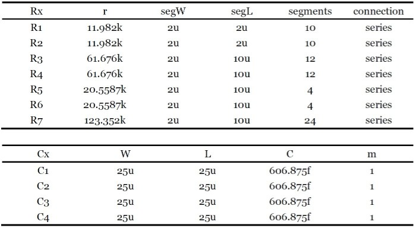
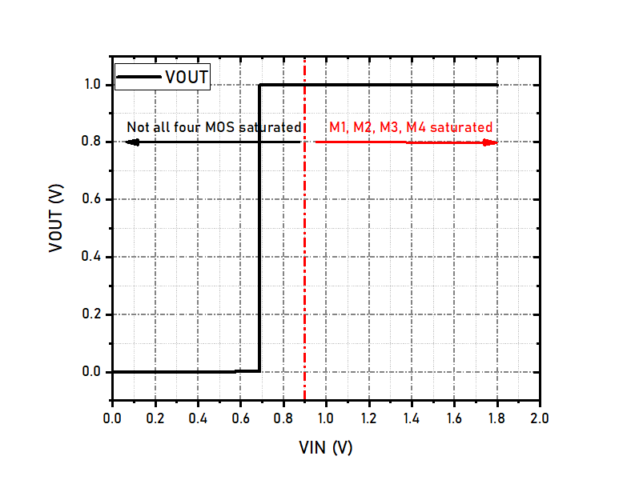
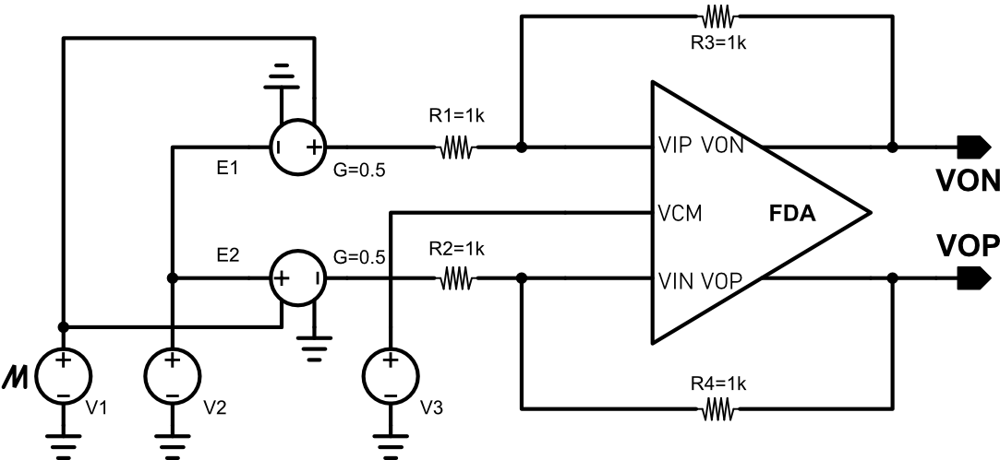
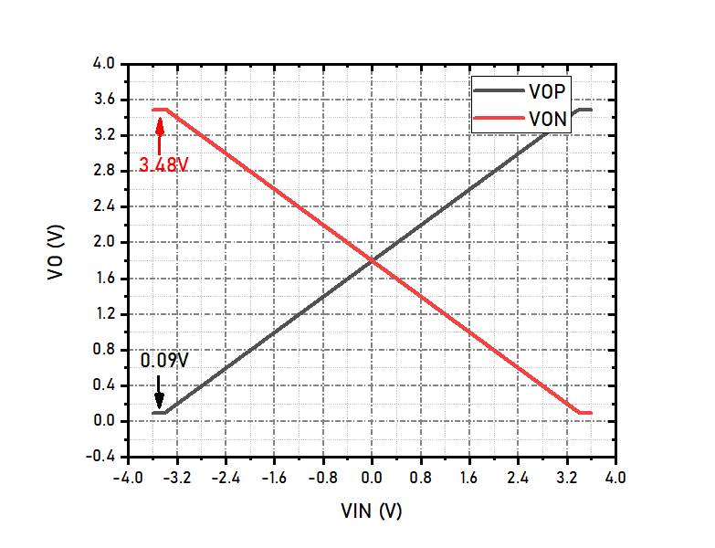
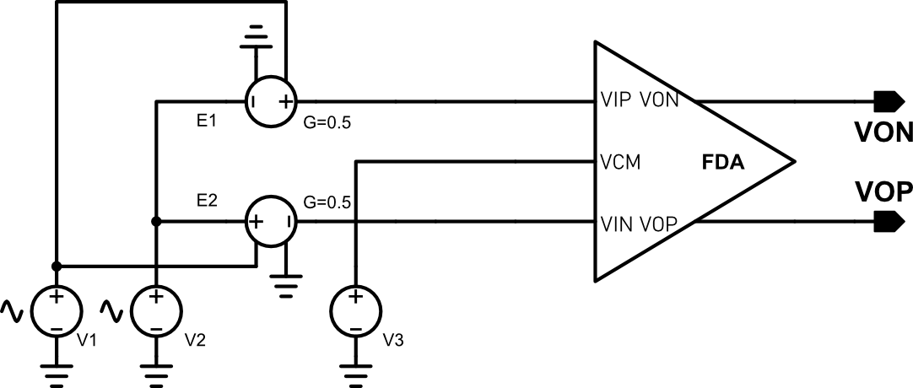
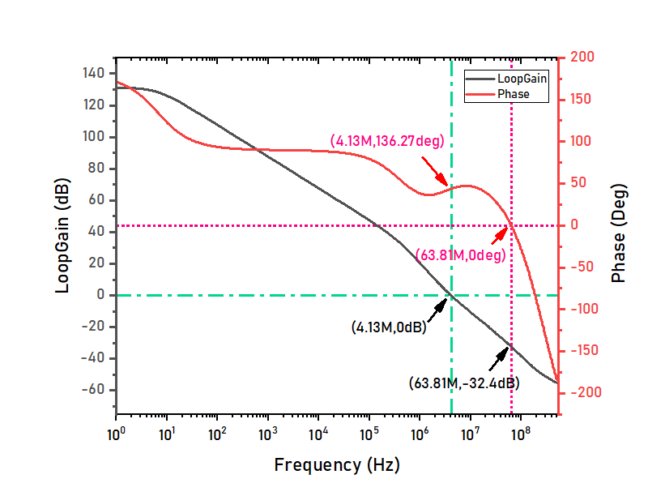
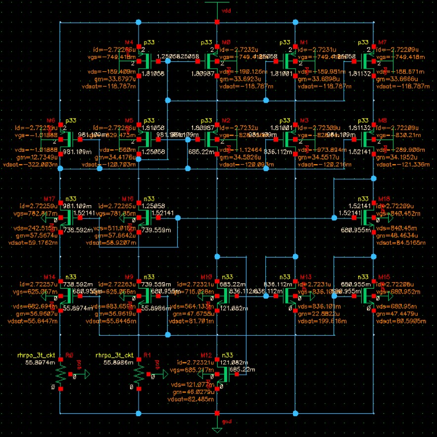
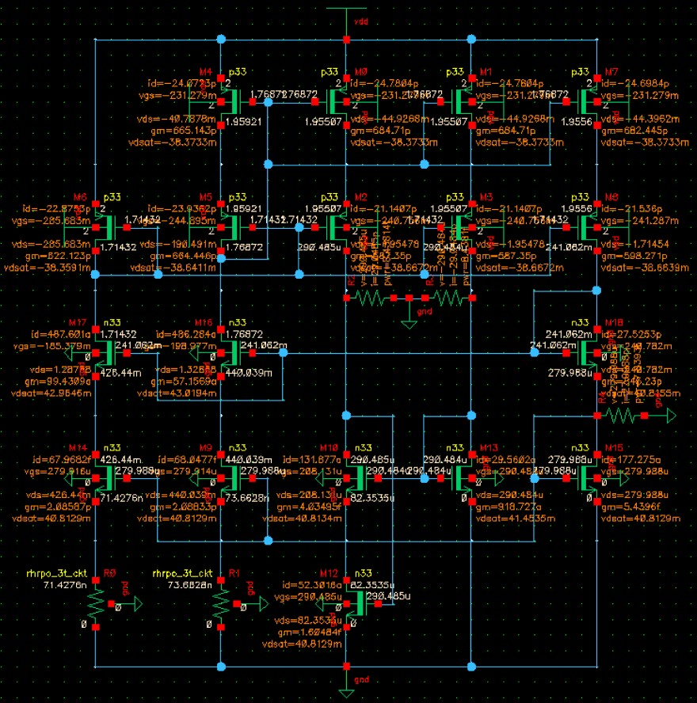
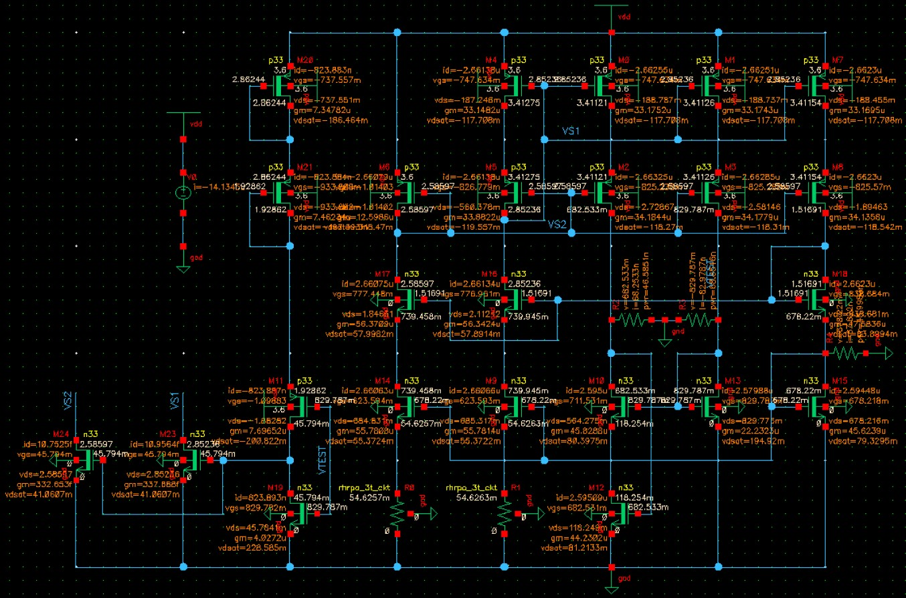
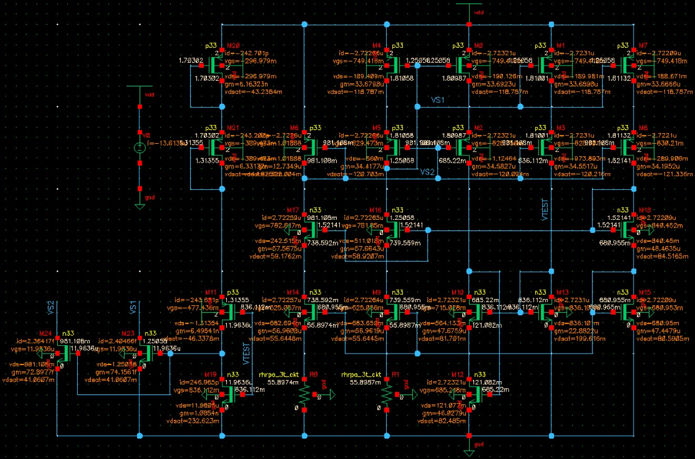

# FDA

# Introduction
**In this project, a fully differential folded cascode operational amplifier has been designed by using the gm/ID methodology. Besides, hand-calculation is used to roughly estimated the other paramters.**   

# Schematic of the FDA
## The Fully Differential Amplifier Core
   

## The Vcm Feedback Circut
   

## The Bias Circuit with Start Up
   

# System Design

## Specifications
  

## Calculation of Unity gain bandwidth
  
To minimize the total area, the value of compensation capacitor should be as small as possible. In this design, a MIM capacitor is used. The smallest MIM capacitor is 606.875fF, which the area is 25umx25um. To achieve at least 10MHz unity gain bandwidth, the gm1 should be no less than 3.8 x 10^-5 S.   

## Calculation of slew rate
  
The formula shown above determines the minimal quiescent current of M8, which is 1.5uA.   

## Calculation of open-loop gain
  
The overall gain of this FDA is achieved by two stage, the first stage is a folded cascode stage and the second stage is a common source stage. To achieve at least 120dB gain, the first stage can be set to achieve 80dB gain and the second stage can be set to achieve 40dB gain.   

## Calculation of power dissipation
The whole circuit consists of three parts, FDA circuit, CMFB circuit and bias circuit. We expect the total power dissipation is no more than 200uW. Since we have known that the drain current of M8 should not be less than 1.5uA, thus we can determine the dc operating point of the whole circuit, which is shown below:   
  

The total current is 35uA, under 3.6V supply voltage, the total power dissipation is 126uW, which is less than 200uW. Although we can increase the current of each branches, since there is a lot of room to do this. But the bias circuit cannot generate any value of current easily, because the current of bias circuit is determined by the resistor, and the resistor cannot set to any value easily. So, in order not to exceed the maximal 200uW power dissipation, we don't need to change the settings.   

## Calculation of common-mode input and output range
The calculation formulae are shown below. VTHN is about 700mV, so the overdrive vlotage of M1, M3 and M4 is about 100mV, so that the minimal input voltage is 1V. Since VTHN is usually larger than overdrive voltage, the maximal input voltage can slightly exceed VCC. The output voltage range is between VSS+Vov15 and VCC+Vov13, so the overdrive voltage cannot exceed 0.2V to meet the requirements.   
  

## The Devices Parameters
According to the prior analysis with the help of gm/ID method, the devices parameters can be calculated, which are shown as follow:   
  
  

# Simualtion Results and Analysis

+ **DC opreating point**   
  
The DC operating points of the circuit are shown above. The real operating point of the circuit has increased about 8%, this is due to the inaccuracy of the resistor as well as channel length modulation effect. The real power dissipation is 138.6uW, which still meet the requirements.    

+ **Open-loop gain**   
  
The open-loop ac response is tested using the above circuit.   
  
The above figure shows the results of the FDA's open loop characteristics. The DC open-loop gain is about 127dB, the unity gain bandwidth is 15.0284MHz. Phase margin is 76deg and gain margin is 22.4dB.    

+ **Step response**   
  
The step response is tested using the above circuit. FDA is configured to have unity gain, and a large swing input pulse is used as stimuli. The following figure shows the step response of the FDA. The output has a 8.2V/us slew rate. Since ID8 is 2.7uA and the compensattion capacitor C1 is 606.875fF, the calculated slew rate is 8.89V/us, which is consistent with the simulation results.   
  

+ **Input common mode voltage range**   
  
The input common mode voltage range is tested using the above circuit. V1, E1 and E2 form a differential voltage source, it outputs a 1V differential voltage. R1~R4 are used to set the gain of FDA to 1, thus, the differential output voltage of FDA should be 1V if it works properly. The VIN and VIP pins have same voltage, their voltage are 0.5(V3 + V3). Since V3 is fixed to 1.8V, which is the output common-mode voltage, by scanning V2 and observing the differential output, we can find the input common mode voltage range. The following figure shows the simulation results, the FDA can be functional when the input common mode voltage is as low as 0.7V, but this is not the valid input common mode voltage because under this condition, M3 and M4 have already entered in to triode region. The lowest possible voltage that both M1, M2, M3 and M4 are all working in saturated region is 0.9V, so the input common mode voltage range is 0.9+VSS ~ VCC.   
  

+ **Output common mode voltage range**   
  
The output common mode voltage range is tested using the above circuit. V1 changes from -3.6V to +3.6V, the differential output is the output common-mode voltage range. The maximal output voltage range is determined by the overdrive voltage of M13, M14, M15 and M16. The overdrive of M13 and M14 are about 119mV, while M15 and M16's overdrive voltage are 90mV. That means the maximal output voltage range is VCC-0.12 ~ VSS+0.09. The simulation result is shown below, and it comply with analysis.   
   

+ **CMRR and CMFB Response**   
  
The CMRR is tested using the above circuit.   
   
   

# Conclusion

# Designing Experience
+ **How to effectively simulate the functionality of a start-up circuit**   
Whether a start-up circuit is functional is of great importance. If the start-up circuit cannot function as what we expected, then it may cause the whole system to fail. During the designing process, I found even if without a start-up circuit, when I ran a DC simulation, the bias circuit can exhibit the right behaviour. Then I proposed a better way to do the simulation, and by adopting this method in many experiments, I found it can verify the functionality of start-up circuit effectively.   
1. Why a bias circuit can exhibit the right behaviour even if without a start-up circuit?    
***I think this is because the NMOS and PMOS's leaking current (off-state current) are not small enough, the gain of the loop is larger than 1, so the positive feedback causes the current increase, then the circuit can start-up by itself.***   
2. How to solve the problem?    
***My newly proposed way is to add damping resistor in the circuit. By adding damping resistors, the bias circuit will no longer start atuomatically if there is no start-up circuit. However, it will not affect the functionality of the whole circuit if a usable start-up circuit is present. But, if the start-up circuit is not a functional one, the whole circuit still cannot start up. In a word, by adding damping resistor can verify the functionality of the start-up circuit.***   
3. An example.   
The following figure shows a self-biasing circuit that can generate four bias voltage, but it don't have a start-up circuit. First, let's run the DC simulation of the circuit.   
    
The results are shown in the following figure, each branch has 2.72uA current, which means the circuit starts up successfully. But in fact, due to process variation and non-ideal factor, this bias circuit may not start up itself as the simulation shows.       
    
**Then, we can add some damping resistors to make the circuit beahve as it is expected in real world. The damping resistor should be large enough so that not affect the circuit too much, 10M ohm is a reasonable value.** The following figure shows the bias circuit with damping resistors (symbols with red line).    
    
Then, let's run the DC simulation of the circuit. The results are shown below:   
    
**Results show that each branch only has 20pA current, which indicates the circuit don't start up. This is exactly what we expect.** Next, we can use this method to verify the functionality of the start-up circuit.   
The following figure shows the bias circuit with start-up, and damping resistors. By adding three damping resistors, the simulation results can reliably show whether the start-up circuit is usable.   
    
When VDD = 3.6V, the simulation results are shown below. **The results show that the start-up circuit can effectively start the circuit when VDD = 3.6V**.   
    
When VDD = 2.0V, the simulation results are shown below. **The results show that the start-up circuit cannot effectively start the circuit when VDD = 2.0V**.   
    
**What if we remove the damping resistors and simulte the circuit again? The results are shown below, and it seems that results show the start-up circuit can effectively start the circuit when VDD = 2.0V, which is totally different from the prior results.**   
    
***In conclusion, without the damping resistor, we cannot find the fact that the start-up circuit actually cannot start up the circuit when VDD = 2V. So the proposed method can effectively verify the functionality of the start-up circuit***   

# Return to Homepage
[Return to Homepage](https://yannanzhang512.github.io/YannanZhang/)
