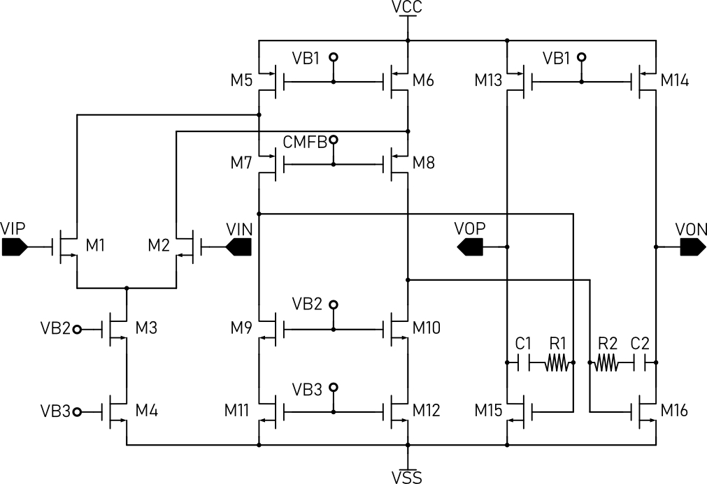
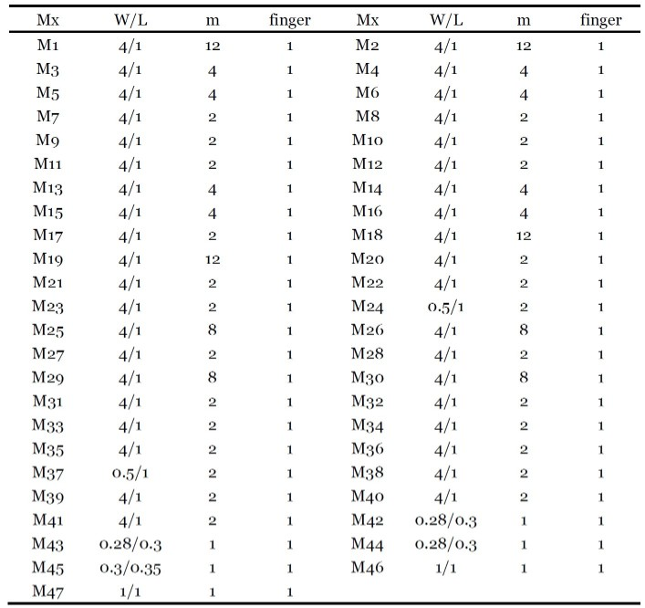
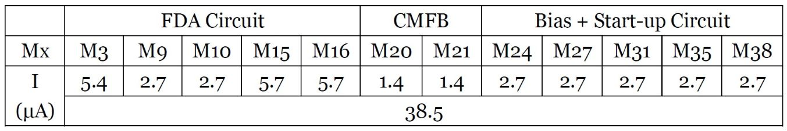
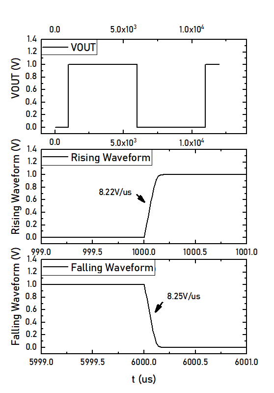
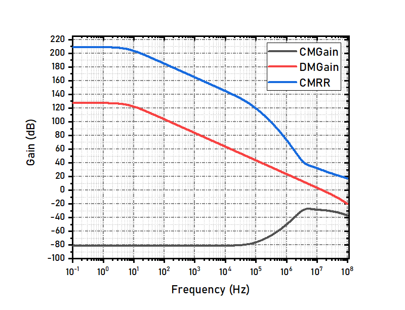
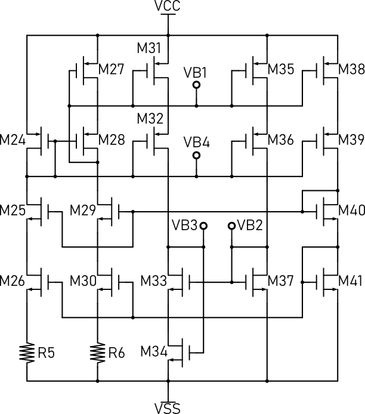
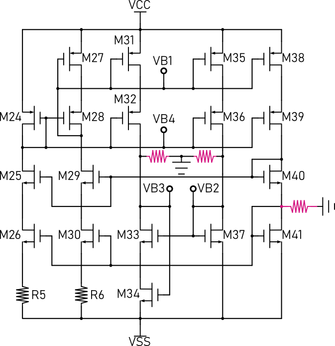
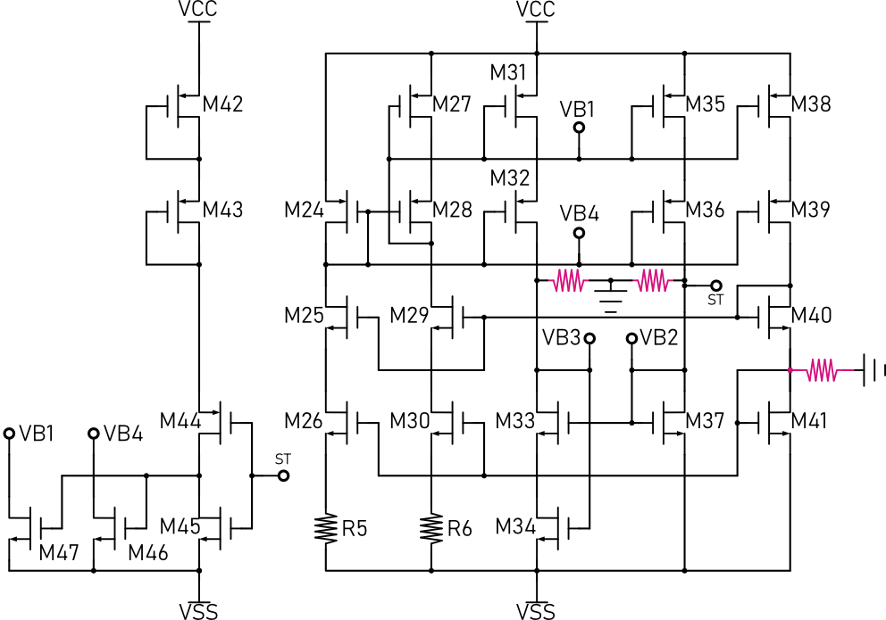
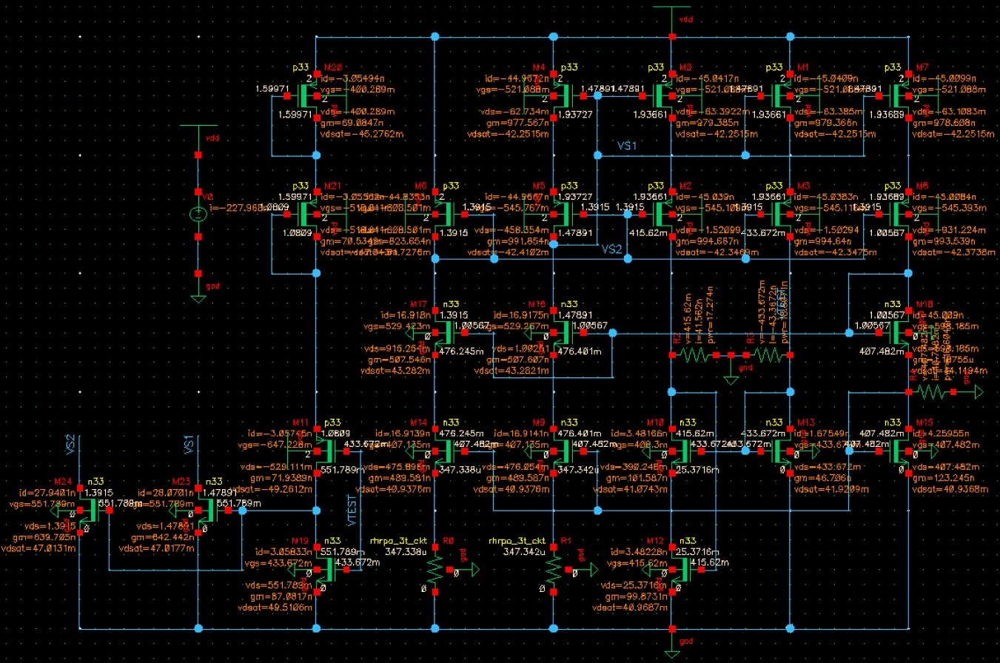

# FDA

# 简介
**本项目使用gm/ID方法实现了一个折叠式共源共栅全差分放大器，基于SMIC 130um工艺，具有15MHz的单位增益带宽，120dB开环电压增益。**   

# 全差分放大器电路图
## 全差分放大器核心电路
   

## 共模电压反馈电路
   

## 带有启动电路的偏置电路
   

# 系统设计

## 参数指标
  

## 单位增益带宽计算
  
为了尽量减小芯片面积，补偿电容的大小要尽量小。在本设计中，补偿电容选用MIM电容，最小的MIM电容是606.875fF, 版图面积为25umx25um. 为获得至少10MHz单位增益带宽，gm1应该不小于3.8 x 10^-5 S.   

## 压摆率计算
  
上式既是压摆率的计算公式，根据补偿电容选用606.875fF，可以计算出M8的静态电流至少为1.5uA.   

## 开环电压增益计算
  
本设计中，全差分放大器的增益由两级提供, 第一季级为折叠式共源共栅放大级，第二级为共源极。为了获得至少120dB开环电压增益，第一级应该至少提供80dB增益，第二级提供40dB增益。   

## 功耗计算
整体电路由三部分组成，全差分放大部分, 共模反馈部分和偏置部分。指标要求最大功耗小于200uW，M8的漏极电流1要大于1.5uA，因此可以粗略估计整个电路各个支路的电流，如下所示：   
  
整体电流为35uA@3.6V,总功耗为126uW。     

## 输入输出共模电压范围计算
输入输出共模电压范围的计算公式如下所示， VTHN大约为700mV, M1, M3 and M4的过驱动电压大约100mV, 因而最小输入电压为1V。同时由于VTHN（阈值电压）通常大于过驱动电压，最大输入电压可以略微超过VCC。输出电压范围为VSS+Vov15到VCC+Vov13, 因此M15和M13的过驱动电压不能超过0.2V。   
  

## 器件参数计算
根据前述分析，利用gm/ID方法可以计算出器件的参数，如下表所示:   
  
  

# 仿真结果和分析

+ **直流工作点**   
  
整体电路的直流工作点如上表所示，仿真结果比计算值大约8%, 偏差产生的原因是沟道长度调制效应以及电阻取值存在偏差。实际器件功耗为138.6uW，仍旧满足要求。    

+ **开环电压增益**   
  
开环电压增益是使用以上电路测试的。   
  
上图为全差分放大器开环电压增益的测试结果。开环电压增益为127dB，单位增益带宽为15.0284MHz。相位裕量为76deg，增益裕量为22.4dB.    

+ **大信号阶跃响应**   
  
大信号阶跃响应可以用来测试全差分放大器的压摆率，测试电路如上图所示。全差分放大器接入反馈网络，增益为1，输入端接入大信号阶跃，观察输出端响应。下图是测试结果，压摆率为8.2V/us。由于ID8为2.7uA，补偿电容C1为606.875fF, 理论计算所得的压摆率为8.89V/us, 理论计算值与实际仿真结果温和地较好。   
  

+ **输入共模电压范围**   
  
输入电压共模范围的测试方法如上图所示， V1, E1 和 E2构成差分电压源并输出1V差分电压。R1~R4为反馈网络，将增益设置为1, 当全差分放大器输入落在允许的共模电压范围内时，则输出电压应为1。根据虚短原理，VIN 和 VIP 有相同的电压，为0.5(V2 + V3). 因为V3固定为1.8V, 通过改变V2的电压并观察输出端电压变化就能够确定输入共模电压范围。下图是测试结果，从结果中看，当输入电压低至0.7V时，全差分放大器都可正常工作，但是这并非是实际的输入共模电压范围。当输入电压低到0.7V时，M3 and M4已经进入线性区。最小的输入电压应能确保M1, M2, M3 和 M4都工作在饱和区，约为0.9V所以实际的输入共模电压范围为0.9+VSS ~ VCC。   
  

+ **输出共模电压范围**   
  
输出共模电压范围的测试电路如上图所示。V1从-3.6V变化到+3.6V, 则输出差分电压就是输出共模电压范围。输出共模电压范围由M13, M14, M15 和 M16的过驱动电压决定。 M13和M14的过驱动电压为119mV，M15 和 M16的过驱动电压为90mV。因而理论的输出共模电压范围为VCC-0.12 ~ VSS+0.09，仿真结果如下图所示，可以看到仿真结果与理论计算值吻合较好。   
   

+ **共模抑制比与共模反馈稳定性**   
  
共模抑制比的测试方法如上图所示。同时其测试结果如下图所示：      
   
   

# 设计经验
+ **如何有效地验证启动电路的可靠性**   
启动电路的可靠性决定电路设计是否成功，如果启动电路不能在任何情况下都有效的启动电路，则意味着电路面临失效问题。在本项目的设计过程中，我发现即使不使用启动电路，对电路进行直流仿真仍然可以得到正确的结果，瞬态仿真也同样如此。我猜想由于在关断状态下，MOS仍存在很小的漏电流，此微弱的漏电流在正反馈的作用下会增加，最终导致电路稳定。为了改进这个问题，我提出了一种仿真方法，通过引入damping resistor人为在关键节点引入一定阻抗，使未启动状态下的启动电路正反馈增益小于1，这样微弱的漏电流不足以启动整个电路。经过我的反复验证，我发现这种方法能够有效验证启动电路的可靠性，能够检验启动电路设计是否合理。   
1. 当没有启动电路时，为何偏置电路能够自启动？    
***我认为这是由于NMOS and PMOS的泄漏电流(关态电流)并不足够小, 在此电流下，环路增益大于1, 正反馈导致此电流增加, 于是偏置电路就能自启动了。然而，虽然仿真的确显示无需启动电路也能工作，但当芯片流片之后，由于各种因素存在，我们不能保证电路同样能正常工作，因而仍旧有必要加入启动电路，确保启动电路是可靠的。***   
2. 如何解决上述问题?    
***My newly proposed way is to add damping resistor in the circuit. By adding damping resistors, the bias circuit will no longer start atuomatically if there is no start-up circuit. However, it will not affect the functionality of the whole circuit if a usable start-up circuit is present. But, if the start-up circuit is not a functional one, the whole circuit still cannot start up. In a word, by adding damping resistor can verify the functionality of the start-up circuit.***   
3. An example.   
The following figure shows a self-biasing circuit that can generate four bias voltage, but it don't have a start-up circuit. First, let's run the DC simulation of the circuit.   
    
The results are shown in the following figure, each branch has 2.72uA current, which means the circuit starts up successfully. But in fact, due to process variation and non-ideal factor, this bias circuit may not start up itself as the simulation shows.       
    
**Then, we can add some damping resistors to make the circuit beahve as it is expected in real world. The damping resistor should be large enough so that not affect the circuit too much, 10M ohm is a reasonable value.** The following figure shows the bias circuit with damping resistors (symbols with red line).    
    
Then, let's run the DC simulation of the circuit. The results are shown below:   
    
**Results show that each branch only has 20pA current, which indicates the circuit don't start up. This is exactly what we expect.** Next, we can use this method to verify the functionality of the start-up circuit.   
The following figure shows the bias circuit with start-up, and damping resistors. By adding three damping resistors, the simulation results can reliably show whether the start-up circuit is usable.   
    
When VDD = 3.6V, the simulation results are shown below. **The results show that the start-up circuit can effectively start the circuit when VDD = 3.6V**.   
    
When VDD = 2.0V, the simulation results are shown below. **The results show that the start-up circuit cannot effectively start the circuit when VDD = 2.0V**.   
    
**What if we remove the damping resistors and simulte the circuit again? The results are shown below, and it seems that results show the start-up circuit can effectively start the circuit when VDD = 2.0V, which is totally different from the prior results.**   
    
***In conclusion, without the damping resistor, we cannot find the fact that the start-up circuit actually cannot start up the circuit when VDD = 2V. So the proposed method can effectively verify the functionality of the start-up circuit***   

# Return to Homepage
[Return to Homepage](https://yannanzhang512.github.io/YannanZhang/)
