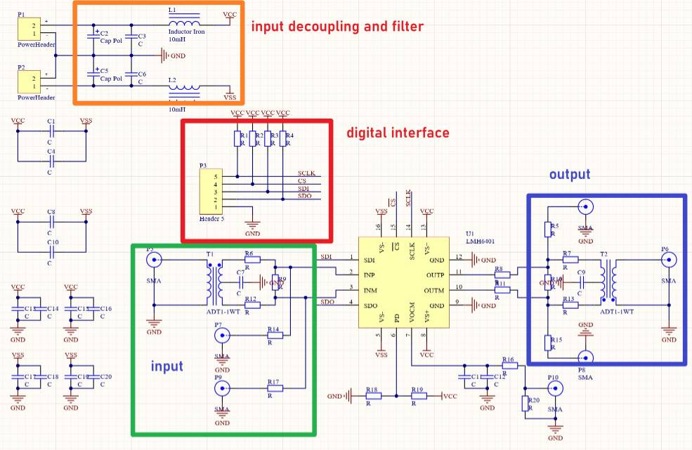
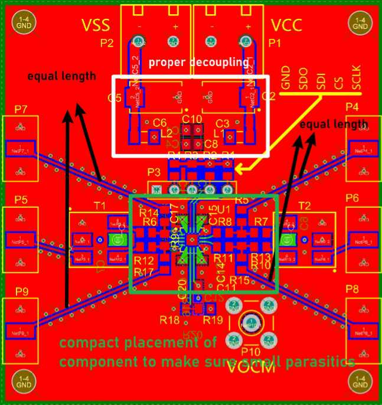
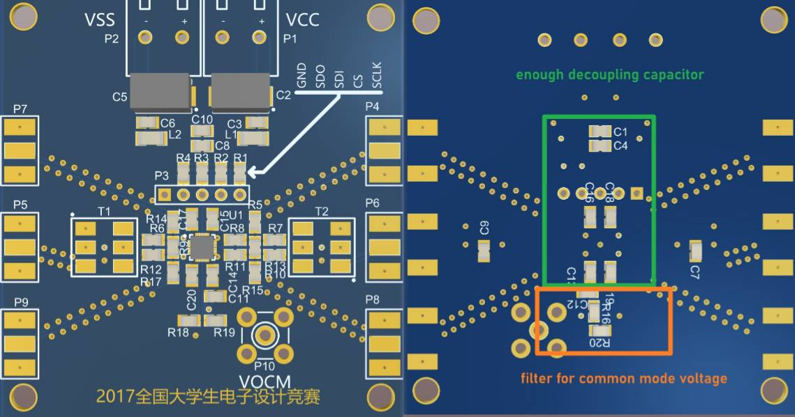
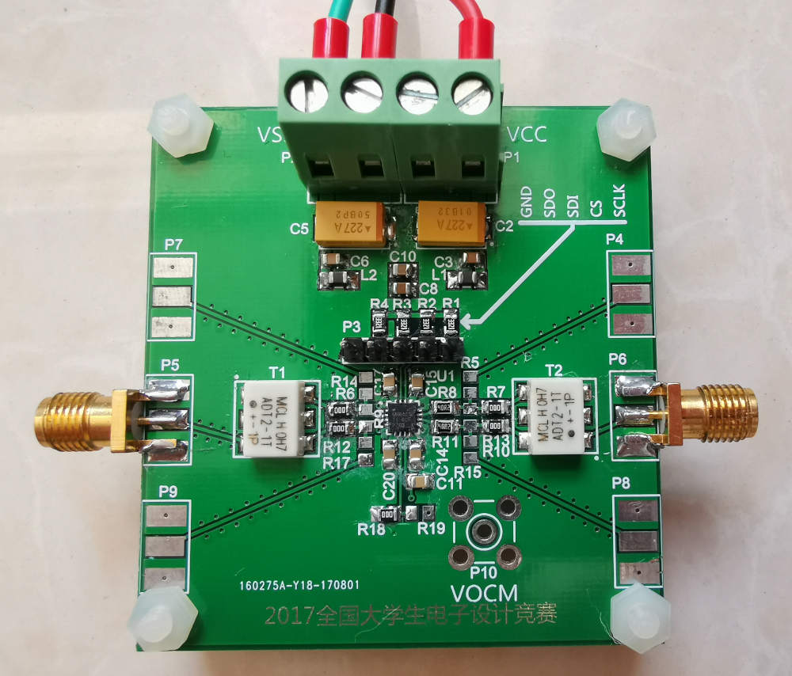

# LMH6401 DC to 4.5 GHz, Fully-Differential, Digital Variable-Gain Amplifier

# Introduction
***This project is to design a demonstration pcb of TI's LMH6401 fully differential DGA. The LMH6401 can work from DC to 4.5GHz, the layout should be carefully considered to work at such high frequency.***      

# Schematic of the demonstration PCB
   
## Filter and decoupling circuit
***To ensure low noise performance, enough decoupling capacitor are used in the schematic. C2, C3, C5, C6 as well as L1, L2 form the input filter to reduce the power supply noise. C1, C4, C8, C10, C13~C20 are used to decouple the circuit.***      

## Single end input to differential input conversion
   
***Transformers are used to convert single-ended input signal to differential input signal and convert differential output signal to single-ended output signal. The using of transformers allow the circuit work with either single-ended signal or differential signal. Any suitable type of transformer can be used here, which lend great flexiblity to the circuit.***    

# Layout of the demonstration PCB
***To ensure the balance of the differential signal, the input signal traces shoule be of equal length, the output signal traces should have same length. In order to reduce parasitics, the placement of components is compact. Moreover, enought decoupling capacitors are used to reduce noise.***   
   
   

The fabricated pcb is shown below:   
   

# Return to Homepage
[Return to Homepage](https://yannanzhang512.github.io/YannanZhang/)
