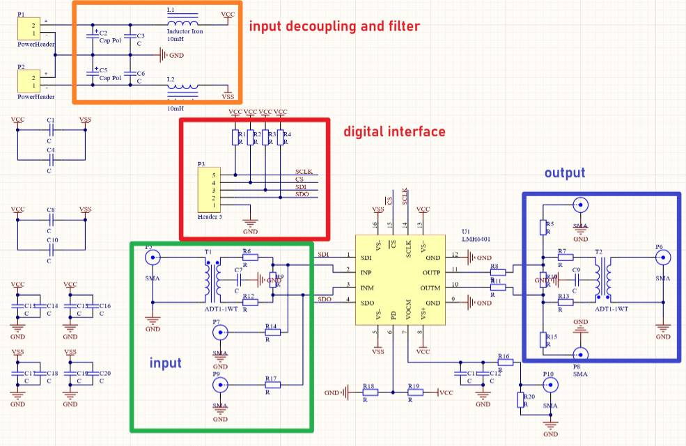
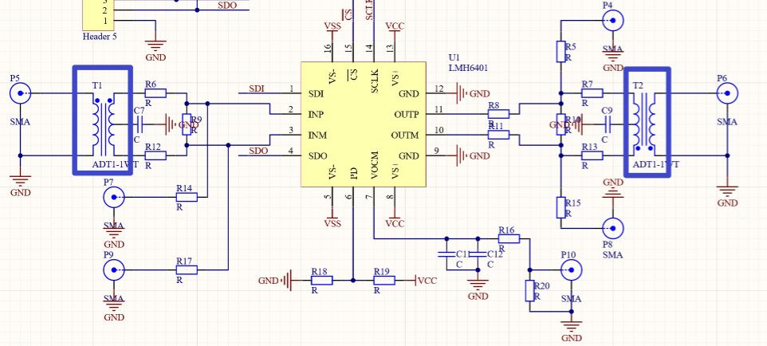
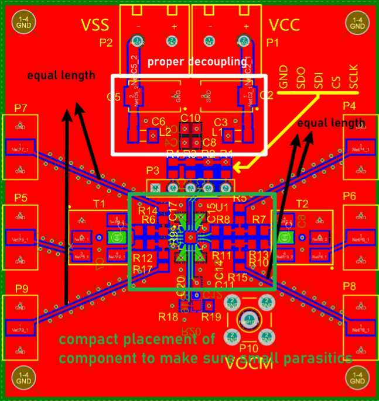
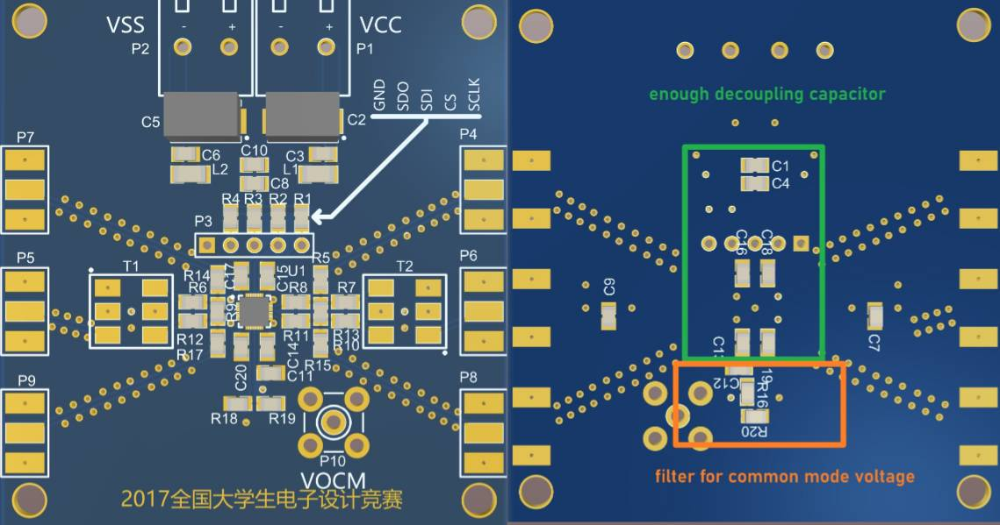

# LMH6401 直流 至 4.5 GHz, 全差分, 数字控制可变增益全差分放大器评估板

# 简介
***本项目是为德州仪器的LMH6401设计的PCB评估板，LMH6401的带宽为直流至4.5GHz, 为了确保高频性能，布局方式需要仔细考虑。***      

# 评估板电路图
   
## 电源滤波与去耦电路
***为了确保系统的噪声尽量低，电路中需要足够的去耦电容。C2, C3, C5, C6 和 L1, L2 构成电源滤波器，降低电源噪声。C1, C4, C8, C10, C13~C20 用来对电源进行去耦。***      

## 单端至差分转换
   
***为了将单端信号和差分信号互相转换，电路中使用了射频变压器。***    

# PCB布局
***为了确保差分信号的平衡性，输入信号走线长度应一致，同时为了减小寄生参数，各元器件的摆放应紧密。同时为了降低噪声，需放置足够的去耦电容。***   
   
   

焊接好的PCB如下图所示:   
   

# 返回主页
[返回主页](https://yannanzhang512.github.io/YannanZhang/pages/index_cn.html)

