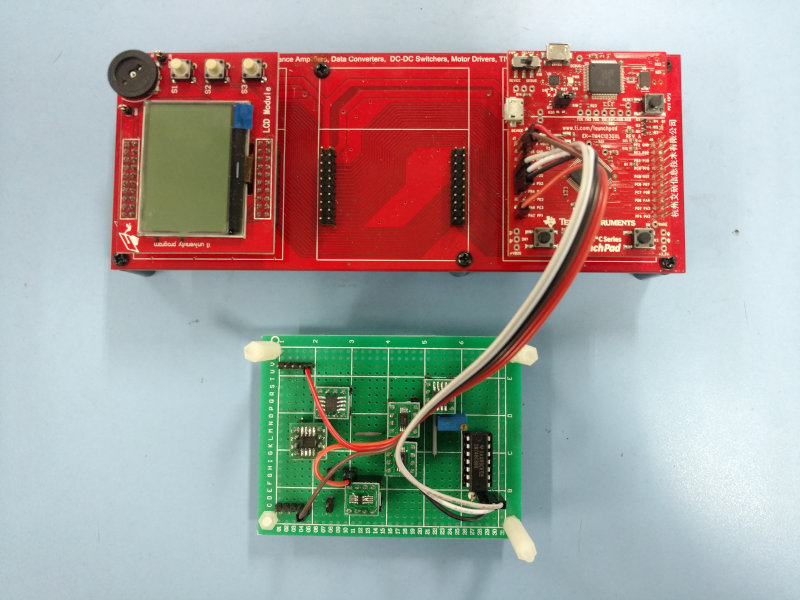
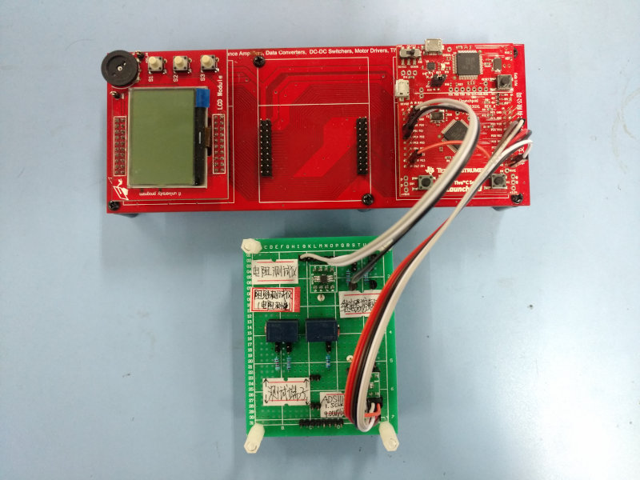
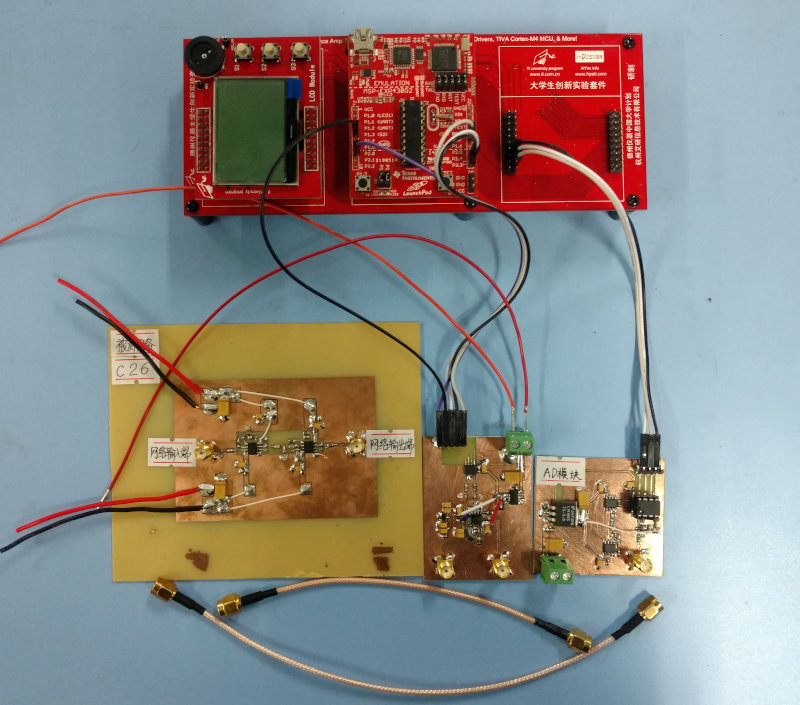
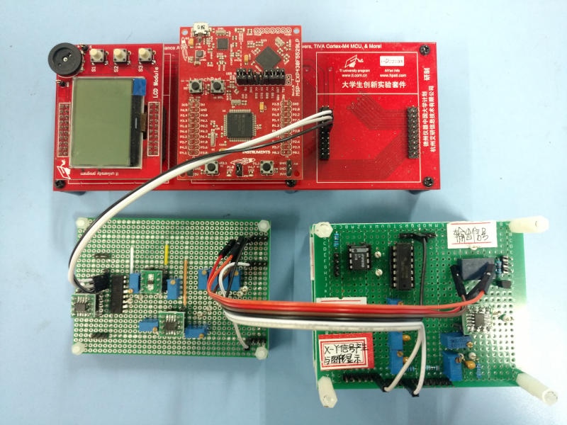
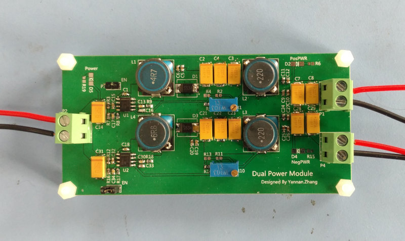

# Part of My Work   

## PCB Layout    
   

## Signal Generator   
  
  

## LC Meter   
     

## Resistance Meter  
     

## Network Analyzer 1  
    

## Network Analyzer 2  
   

## Dual Power Supply Module   
     

## Others   
  
